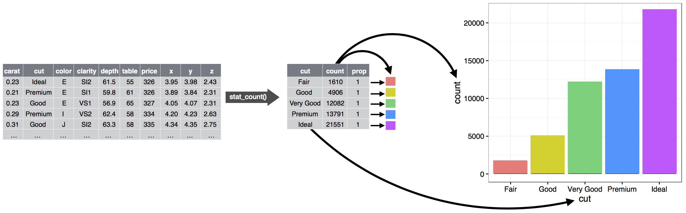

# Layers
Total points: 71

```{r setup global options}
# setup global options
source("_common.R")
```

## Introduction

In this chapter, you'll expand on your ggplot2 foundation as you learn about the layered grammar of graphics.
We'll start with a deeper dive into aesthetic mappings, geometric objects, and facets.
Then, you will learn about statistical transformations ggplot2 makes under the hood when creating a plot.
These transformations are used to calculate new values to plot, such as the heights of bars in a bar plot or medians in a box plot.
You will also learn about position adjustments, which modify how geoms are displayed in your plots.

We will not cover every single function and option for each of these layers, but we will walk you through the most important and commonly used functionality provided by ggplot2 as well as introduce you to packages that extend ggplot2.

### Prerequisites

This chapter focuses on ggplot2.
To access the datasets, help pages, and functions used in this chapter, first install the packages `patchwork` and `ggridges` if you need to by uncommenting this code:

```{r}

# install.packages(c("patchwork","ggridges","scales))

```

Then load the necessary packages into your session:

```{r}
library(tidyverse)
library(patchwork)
library(scales)
library(ggplot2)
library(ggrepel)
```


## Aesthetic mappings

The `mpg` data frame is bundled with the ggplot2 package and contains `r nrow(mpg)` observations on `r mpg %>% distinct(model) %>% nrow()` car models.

```{r}
#?mpg

nrow(mpg)

sapply(mpg,class)
```

Among the variables in `mpg` are:

1. `displ`: A car's engine size, in liters.
    A numerical variable.

2. `hwy`: A car's fuel efficiency on the highway, in miles per gallon (mpg).
    A car with a low fuel efficiency consumes more fuel than a car with a high fuel efficiency when they travel the same distance.
    A numerical variable.

3. `class`: Type of car.
    A categorical variable.

Let's start by visualizing the relationship between `displ` and `hwy` for various `classes` of cars.
We can do this with a scatterplot where the numerical variables are mapped to the `x` and `y` aesthetics and the categorical variable is mapped to an aesthetic like `color` or `shape`

```{r}
#| fig-width: 10
#| fig-asp: 0.4
#| fig-show: hold
#| fig-alt: |
#|   Two scatterplots next to each other, both visualizing highway fuel 
#|   efficiency versus engine size of cars and showing a negative 
#|   association. In the plot on the left class is mapped to the color 
#|   aesthetic, resulting in different colors for each class. 
#|   In the plot on the right class is mapped the shape aesthetic, 
#|   resulting in different plotting character shapes for each class,
#|   except for suv. Each plot comes with a legend that shows the 
#|   mapping between color or shape and levels of the class variable.

ggplot(mpg, aes(x = displ, y = hwy, color = class)) +
  geom_point() + ggplot(mpg, aes(x = displ, y = hwy, shape = class)) + geom_point() +   plot_layout(ncol = 2)
```

Note the use of `plot_layout` from the `patchwork` package to layout the plots in two rows.
You can also use mathematical symbols to layout `ggplots`:

Use `+` to plot them side-by-side:

```{r}
#| fig-width: 10
#| fig-asp: 0.4
ggplot(mpg, aes(x = displ, y = hwy, color = class)) + geom_point() + 
  ggplot(mpg, aes(x = displ, y = hwy, shape = class)) + geom_point() 
```

Use '/' to plot them in one column:

```{r}
#| fig-height: 10
#| fig.width: 7
#| out-width: "100%"

(ggplot(mpg, aes(x = displ, y = hwy, color = class)) + geom_point())/ (ggplot(mpg, aes(x = displ, y = hwy, shape = class)) + geom_point())
```

Notice that parentheses are required for this operation unless you first save the plots:

```{r}
#| fig.height: 10

p1 <- ggplot(mpg, aes(x = displ, y = hwy, color = class)) + geom_point()

p2 <- ggplot(mpg, aes(x = displ, y = hwy, shape = class)) + geom_point()

p1/p2

```

When `class` is mapped to `shape`, we get two warnings:

> 1: The shape palette can deal with a maximum of 6 discrete values because more than 6 becomes difficult to discriminate; you have 7.
> Consider specifying shapes manually if you must have them.
>
> 2: Removed 62 rows containing missing values (`geom_point()`).

Since `ggplot2` will only use six shapes at a time, by default, additional groups will go unplotted when you use the shape aesthetic.
The second warning is related -- there are 62 SUVs in the dataset and they're not plotted.

Similarly, we can map `class` to `size` or `alpha` aesthetics as well, which control the size and the transparency of the points, respectively.

```{r}
#| fig-width: 5
#| fig-alt: |
#|   Two scatterplots next to each other, both visualizing highway fuel 
#|   efficiency versus engine size of cars and showing a negative 
#|   association. In the first plot class is mapped to the size 
#|   aesthetic, resulting in different sizes for each class. 
#|   In the second plot class is mapped the alpha aesthetic, 
#|   resulting in different alpha (transparency) levels for each class. 
#|   Each plot comes with a legend that shows the mapping between size 
#|   or alpha level and levels of the class variable.

# class mapped to size
ggplot(mpg, aes(x = displ, y = hwy, size = class)) +
  geom_point() 

# class mapped to alpha
ggplot(mpg, aes(x = displ, y = hwy, alpha = class)) +
  geom_point() 
```

Both of these produce warnings as well:

> Using size for a discrete variable is not advised.
> Using alpha for a discrete variable is not advised.

Mapping an unordered discrete (categorical) variable (`class`) to an ordered aesthetic (`size` or `alpha`) is generally not a good idea because it implies a ranking that does not in fact exist.

Once you map an aesthetic, `ggplot2` takes care of the rest.
It selects a reasonable scale to use with the aesthetic, and it constructs a legend that explains the mapping between levels and values.
For x and y aesthetics, `ggplot2` does not create a legend, but it creates an axis line with tick marks and a label.
The axis line provides the same information as a legend; it explains the mapping between locations and values.

You can also set the visual properties of your `geom` manually as an argument of your `geom` function (*outside* of `aes()`) instead of relying on a variable mapping to determine the appearance.
For example, we can make all of the points in our plot blue:

```{r}
#| fig-alt: |
#|   Scatterplot of highway fuel efficiency versus engine size of cars 
#|   that shows a negative association. All points are blue.

ggplot(mpg, aes(x = displ, y = hwy)) + 
  geom_point(color = "blue") 
```

Here, the color doesn't convey information about a variable, but only changes the appearance of the plot.
You'll need to pick a value that makes sense for that aesthetic:

-   The name of a color as a character string, e.g., `color = "blue"`
-   The size of a point in mm, e.g., `size = 1`
-   The shape of a point as a number, e.g, `shape = 1`, as shown in \@ref(fig:fig-shapes).

```{r}
#| label: fig-shapes
#| echo: false
#| 
#| fig.asp: 0.364
#| fig-align: "center"
#| fig-cap: |
#|   R has 25 built-in shapes that are identified by numbers. There are some 
#|   seeming duplicates: for example, 0, 15, and 22 are all squares. The 
#|   difference comes from the interaction of the `color` and `fill` 
#|   aesthetics. The hollow shapes (0--14) have a border determined by `color`; 
#|   the solid shapes (15--20) are filled with `color`; the filled shapes 
#|   (21--24) have a border of `color` and are filled with `fill`. Shapes are 
#|   arranged to keep similar shapes next to each other.  
#| fig-alt: |
#|   Mapping between shapes and the numbers that represent them: 0 - square, 
#|   1 - circle, 2 - triangle point up, 3 - plus, 4 - cross, 5 - diamond, 
#|   6 - triangle point down, 7 - square cross, 8 - star, 9 - diamond plus, 
#|   10 - circle plus, 11 - triangles up and down, 12 - square plus, 
#|   13 - circle cross, 14 - square and triangle down, 15 - filled square, 
#|   16 - filled circle, 17 - filled triangle point-up, 18 - filled diamond, 
#|   19 - solid circle, 20 - bullet (smaller circle), 21 - filled circle blue, 
#|   22 - filled square blue, 23 - filled diamond blue, 24 - filled triangle 
#|   point-up blue, 25 - filled triangle point down blue.

shapes <- tibble(
  shape = c(0, 1, 2, 5, 3, 4, 6:19, 20, 21, 22, 23, 24),
  x = (0:24 %/% 5) / 2,
  y = (-(0:24 %% 5)) / 4
)
ggplot(shapes, aes(x, y)) + 
  geom_point(aes(shape = shape), size = 5, fill = "red") +
  geom_text(aes(label = shape), hjust = 0, nudge_x = 0.15) +
  scale_shape_identity() +
  expand_limits(x = 4.1) +
  scale_x_continuous(NULL, breaks = NULL) + 
  scale_y_continuous(NULL, breaks = NULL, limits = c(-1.2, 0.2)) + 
  theme_minimal() +
  theme(aspect.ratio = 1/2.75)
```

So far we have discussed aesthetics that we can map or set in a scatterplot, when using a point geom.
You can learn more about all possible aesthetic mappings in the aesthetic specifications vignette at <https://ggplot2.tidyverse.org/articles/ggplot2-specs.html>.

The specific aesthetics you can use for a plot depend on the geom you use to represent the data.
In the next section we dive deeper into geoms.

### 2.2.1 Exercises {.unnumbered}

1. Create a scatterplot of `hwy` vs. `displ` where the points are pink filled in triangles. 2pts

::: {.fold .s .o}
```{r Ans:2.2.1.1}

ggplot(mpg, aes(x = hwy, y = displ)) +
  geom_point(color = "pink", shape = "triangle")
```
:::

2. Why did the following code not result in a plot with blue points? 2pts

```{r}
#| fig-show: hide
#| fig-alt: |
#|   Scatterplot of highway fuel efficiency versus engine size of cars  
#|   that shows a negative association. All points are red and 
#|   the legend shows a red point that is mapped to the word blue.

ggplot(mpg) + 
  geom_point(aes(x = displ, y = hwy, color = "blue"))
```

::: {.fold .s .o}
**Ans-2.2.1.2:**

```{r Ans-2.2.1.2}
#| fig-show: hide

# Color should be set outside of the aesthetic mapping. If you check what's going inside aes(), you find displ (your x variable), and hwy (your y variable). How does "blue" fit in here? It actually doesn't. As "blue" (a string) doesn't exist in your dataframe, it's not applied to your plot as a new coloring aesthetic. Instead, it will only be added to your legend (here "blue" could have been any string).

ggplot(mpg) +
  geom_point(aes(x = displ, y = hwy), color = "blue")
```
:::

3. What does the `stroke` aesthetic do? What shapes does it work with? (Hint: use `?geom_point`) 2pts

::: {.fold .s .o}
**Ans-2.2.1.3:**

```{r Ans-2.2.1.3}
# Stroke controls the width of the edge/border of the points for shapes 21-24 (filled circle, square, triangle, and diamond)
 
ggplot(mpg) +  geom_point(
  aes(x = displ, y = hwy),
  shape = 24,
  fill = "red",
  color = "blue",
  stroke = 1
)

ggplot(mpg) +  geom_point(
  aes(x = displ, y = hwy),
  shape = 21,
  fill = "purple",
  color = "red",
  stroke = 2,
  size = 8
)
```
:::

4. What happens if you map an aesthetic to something other than a variable name, like `aes(color = displ < 5)`? Try it by adding color to the following plot: 2pts

```{r}
#| fig-show: hide

ggplot(mpg) + geom_point(aes(x = displ, y = hwy))
```

::: {.fold .s .o}
**Ans-2.2.1.4:**

```{r Ans-2.2.1.4}

# It creates a logical variable with values `TRUE` and `FALSE` for cars with displacement values below and above 5. In general, mapping an aesthetic to something other than a variable first evaluates that expression then maps the aesthetic to the outcome.

ggplot(mpg) + 
  geom_point(aes(x = displ, y = hwy, color = displ < 5)) 
```
:::

## Geometric objects

How are these two plots similar?

```{r}
#| fig-show: hide

(ggplot(mpg, aes(x = displ, y = hwy)) +  geom_point()) +

(ggplot(mpg, aes(x = displ, y = hwy)) + geom_smooth())
```

Both plots contain the same x variable, the same y variable, and both describe the same data. But the plots are not identical. Each plot uses a different geometric object, `geom`, to represent the data. The first plot uses the point geom, and the plot on the second uses the smooth geom, a smooth line fitted to the data.

To change the geom in your plot, change the geom function that you add to `ggplot()`. For instance, to make the plots above, you can use the following code:

```{r}
#| fig-width: 6
# point
ggplot(mpg, aes(x = displ, y = hwy)) + geom_point() +

# smooth
ggplot(mpg, aes(x = displ, y = hwy)) + geom_smooth()
```

Every geom function in ggplot2 takes a `mapping` argument, either defined locally in the geom layer or globally in the `ggplot()` layer.

However, not every aesthetic works with every geom. You could set the shape of a point, but you couldn't set the "shape" of a line. If you try, ggplot2 will silently ignore that aesthetic mapping. On the other hand, you *could* set the `linetype` of a line.

`geom_smooth()` will draw a different line, with a different `linetype`, for each unique value of the variable that you map to `linetype`.

```{r}
#| fig-width: 6
#| fig-show: hold
#| fig-alt: |
#|   Two plots of highway fuel efficiency versus engine size of cars.
#|   The data are represented with smooth curves. In the first plot, three 
#|   smooth curves, all with the same linetype. In the second plot, three 
#|   smooth curves with different line types (solid, dashed, or long 
#|   dashed) for each type of drive train. In both plots, confidence 
#|   intervals around the smooth curves are also displayed.

# Top
(ggplot(mpg, aes(x = displ, y = hwy, shape = drv)) + 
  geom_smooth()) /

# Bottom
(ggplot(mpg, aes(x = displ, y = hwy, linetype = drv)) + 
  geom_smooth())
```

Here, `geom_smooth()` separates the cars into three lines based on their `drv` value, which describes a car's drive train.
One line describes all of the points that have a `4` value, one line describes all of the points that have an `f` value, and one line describes all of the points that have an `r` value.
Here, `4` stands for four-wheel drive, `f` for front-wheel drive, and `r` for rear-wheel drive.

**Notice there is no legend for the first plot because geometric smooth does not have a shape aesthetic.**

If this sounds strange, we can make it clearer by overlaying the lines on top of the raw data and then coloring everything according to `drv`.

```{r}
#| fig-width: 6
#| fig-alt: |
#|   A plot of highway fuel efficiency versus engine size of cars. The data 
#|   are represented with points (colored by drive train) as well as smooth 
#|   curves (where line type is determined based on drive train as well). 
#|   Confidence intervals around the smooth curves are also displayed.

ggplot(mpg, aes(x = displ, y = hwy, color = drv)) +
  geom_point() + geom_smooth(aes(linetype = drv))

```

Notice that this plot contains two geoms in the same graph.

Many geoms, like `geom_smooth()`, use a single geometric object to display multiple rows of data.
For these geoms, you can set the `group` aesthetic to a categorical variable to draw multiple objects.
ggplot2 will draw a separate object for each unique value of the grouping variable.

In practice, ggplot2 will automatically group the data for these geoms whenever you map an aesthetic to a discrete variable (as in the `linetype` example).

It is convenient to rely on this feature because the `group` aesthetic by itself does not add a legend or distinguishing features to the geoms.

If you place mappings in a geom function, ggplot2 will treat them as local mappings for the layer.
It will use these mappings to extend or overwrite the global mappings *for that layer only*.
This makes it possible to display different aesthetics in different layers.

```{r}
#| fig-alt: |
#|   Scatterplot of highway fuel efficiency versus engine size of cars, where 
#|   points are colored according to the car class. A smooth curve following 
#|   the trajectory of the relationship between highway fuel efficiency versus 
#|   engine size of cars is overlaid along with a confidence interval around it.

ggplot(mpg, aes(x = displ, y = hwy)) + 
  geom_point(aes(color = class)) + 
  geom_smooth()
```

You can use the same idea to specify different `data` for each layer.
Here, we use red points as well as open circles to highlight two-seater cars.
The local data argument in `geom_point()` overrides the global data argument in `ggplot()` for that layer only.

```{r}
#| fig-alt: |
#|   Scatterplot of highway fuel efficiency versus engine size of cars, where 
#|   points are colored according to the car class. A smooth curve following 
#|   the trajectory of the relationship between highway fuel efficiency versus 
#|   engine size of subcompact cars is overlaid along with a confidence interval 
#|   around it.

g <- ggplot(mpg, aes(x = displ, y = hwy)) +
  geom_point() +
  geom_point(data = mpg %>% filter(class == '2seater'),
             color = "red")

g + geom_point(
  data = mpg %>% filter(class == '2seater'),
  shape = "circle open",
  size = 3,
  color = "red"
)
```

Geoms are the fundamental building blocks of ggplot2.
You can completely transform the look of your plot by changing its geom, and different geoms can reveal different features of your data.
For example, the histogram and density plot below reveal that the distribution of highway mileage is bimodal and right skewed while the boxplot reveals two potential outliers.

```{r}
#| fig.width: 6
#| fig-alt: |
#|   Three plots: histogram, density plot, and box plot of highway
#|   mileage.
 
# histogram
ggplot(mpg, aes(x = hwy)) + geom_histogram(binwidth = 2)

# density
ggplot(mpg, aes(x = hwy)) + geom_density()

# boxplot
ggplot(mpg, aes(x = hwy)) + geom_boxplot()
```

ggplot2 provides more than 40 geoms but these don't cover all possible plots one could make.
If you need a different geom, we recommend looking into extension packages first to see if someone else has already implemented it (see <https://exts.ggplot2.tidyverse.org/gallery/> for a sampling).

For example, the **ggridges** package ([https://wilkelab.org/ggridges](https://wilkelab.org/ggridges/){.uri}) is useful for making ridgeline plots, which can be useful for visualizing the density of a numerical variable for different levels of a categorical variable.

In the following plot not only did we use a new geom (`geom_density_ridges()`), but we have also mapped the same variable to multiple aesthetics (`drv` to `y`, `fill`, and `color`) as well as set an aesthetic (`alpha = 0.5`) to make the density curves transparent.

```{r}
#| fig-width: 6
#| fig-height: 6
#| fig-alt: 
#|   Density curves for highway mileage for cars with rear wheel, 
#|   front wheel, and 4-wheel drives plotted separately. The 
#|   distribution is bimodal and roughly symmetric for real and 
#|   4 wheel drive cars and unimodal and right skewed for front 
#|   wheel drive cars.

library(ggridges)

ggplot(mpg, aes(x = hwy, y = drv, fill = drv, color = drv)) +
  geom_density_ridges(alpha = 0.5, show.legend = FALSE)
```

The best place to get a comprehensive overview of all of the geoms ggplot2 offers, as well as all functions in the package, is the reference page: <https://ggplot2.tidyverse.org/reference>.
To learn more about any single geom, use the help (e.g., `?geom_smooth`).

### 2.3.1 Exercises {.unnumbered}

1.
    a) What geom would you use to draw a line chart? A boxplot? A histogram? An area chart? 4pts

```{r, echo = FALSE}
library(details)
```

```{details,details.summary = "Ans-2.3.1.1a:",echo = F}
library(stringr)
library(xfun)
raw_string(str_wrap("For a line chart you can use `geom_path()` or `geom_line()`. 
                    
For a boxplot you can use `geom_boxplot()`.

For a histogram, `geom_histogram()`.

For an area chart, `geom_area()`.", width = 80))

```

    b) Use the following ggplot to create 4 plots, `geom_line()`, `geom_boxplot()`, `geom_point()` and `geom_area()`. Include a title specifying the geometry for each. 4pts

```{r}
df <- data.frame(
  x = c(3, 1, 5), 
  y = c(2, 4, 6), 
  label = c("a","b","c")
)
p <- ggplot(df, aes(x, y, label = label))  
  
```

::: {.fold .s .o}
**Ans-2.3.1.1b:**

```{r Ans-2.3.1.1b}
#| fig-width: 5 # this means a height of 4
#| fig-align: "center" 

p + geom_line() + ggtitle("line")
p + geom_boxplot() + ggtitle("boxplot")
p + geom_point() + ggtitle("point")
p + geom_area() + ggtitle("area")
```
:::

2. Earlier in this chapter we used `show.legend` without explaining it:

```{r}
#| fig-show: hide
ggplot(mpg, aes(x = displ, y = hwy)) +
  geom_smooth(aes(color = drv), show.legend = FALSE)
```

What does `show.legend = FALSE` do here? What happens if you remove it? Try it. 2pts


::: {.fold .s .o}
**Ans-2.3.1.2:**

```{r Ans-2.3.1.2}
#| fig-width: 5
#| fig.align: "center" 
# It removes the legend for the geom it's specified in, in this case it removes the legend for the smooth lines that are colored based on `drv`.
# 
# If you remove `show.legend`, it will show the legend as show.legend = T is the default.

ggplot(mpg, aes(x = displ, y = hwy)) +
  geom_smooth(aes(color = drv))
```
:::

3. What does the `se` argument to `geom_smooth()` do? 2pts

```{details, details.summary = "Ans-2.3.1.3:",echo=F}
library(xfun)
raw_string(str_wrap('It displays the confidence interval around the smooth line.\n You can remove this with `se = FALSE`.'))
```

4. Recreate the R code necessary to generate and save the following graph \@ref(fig:6-plots) and arrange them in a figure with 2 columns. Note that wherever a categorical variable is used in the plot, it's `drv`. Use the mathematical notation in one, and the function from `patchwork`, `plot_layout` in another for laying out the plot. 7pts

```{r}
#| label: 6-plots
#| echo: false
#| out-width: "100%"
#| fig-cap: |
#|   Six plots arranged in two columns
#| fig-alt: |
#|   There are six scatterplots in this figure, arranged in a 3x2 grid. 
#|   In all plots highway fuel efficiency of cars are on the y-axis and 
#|   engine size is on the x-axis. The **first** plot shows all points in black
#|   with a smooth curve overlaid on them. In the **second** plot points are 
#|   also all black, with separate smooth curves overlaid for each level of 
#|   drive train. On the **third** plot, points and the smooth curves are 
#|   represented in different colors for each level of drive train. In the 
#|   **fourth** plot the points are represented in different colors for each 
#|   level of drive train but there is only a single smooth line fitted to 
#|   the whole data. In the **fifth** plot, points are represented in different
#|   colors for each level of drive train, and a separate smooth curve with 
#|   line types are fitted to each level of drive train. And 
#|   finally in the **sixth** plot points are represented in different colors 
#|   for each level of drive train and they have a thick white border.

knitr::include_graphics("images/6-plots.png")
```

::: {.fold .s .o}
**Ans-2.3.1.4:**

```{r, Ans-2.3.1.4}

p1 <- ggplot(mpg, aes(x = displ, y = hwy)) + 
      geom_point() + 
      geom_smooth(se = FALSE)
p2 <- ggplot(mpg, aes(x = displ, y = hwy)) + 
      geom_smooth(aes(group = drv), se = FALSE) +
      geom_point()
p3 <- ggplot(mpg, aes(x = displ, y = hwy, color = drv)) + 
      geom_point() + 
      geom_smooth(se = FALSE)
p4 <- ggplot(mpg, aes(x = displ, y = hwy)) + 
      geom_point(aes(color = drv)) + 
      geom_smooth(se = FALSE)
p5 <- ggplot(mpg, aes(x = displ, y = hwy)) + 
      geom_point(aes(color = drv)) +
      geom_smooth(aes(linetype = drv), se = FALSE)
p6 <- ggplot(mpg, aes(x = displ, y = hwy)) + 
      geom_point(size = 4, color = "white") + 
      geom_point(aes(color = drv)) 
    
    
# Combine the plots
    
(p1 + p2) / (p3 + p4) / (p5 + p6)
    
# OR

library(patchwork)
p1 + p2 + p3 + p4 + p5 + p6 +
  plot_layout(ncol = 2)

```
:::

**Notice the plots don't line up as nicely if you don't use the `plot_layout` function from patchwork because of the figure legends.**

## Facets

Another way, which is particularly useful for categorical variables, is to split your plot into **facets**, subplots that each display one subset of the data.

To facet your plot by a single variable, use `facet_wrap()`.
The first argument of `facet_wrap()` is a formula, which you create with `~` followed by a variable name.
The variable that you pass to `facet_wrap()` should be categorical.

Here "formula" is the name of the thing created by `~`, not a synonym for "equation".

```{r}
#| fig-width: 7
#| fig-alt: |
#|   Scatterplot of highway fuel efficiency versus engine size of cars, 
#|   faceted by class, with facets spanning two rows.

ggplot(mpg, aes(x = displ, y = hwy)) + 
  geom_point() + 
  facet_wrap(~cyl)
```

To facet your plot with the combination of two variables, switch from `facet_wrap()` to `facet_grid()`.
The first argument of `facet_grid()` is also a formula, but now it's a double sided formula: `rows ~ cols`.

```{r}
#| fig-width: 6
#| fig-alt: |
#|   Scatterplot of highway fuel efficiency versus engine size of cars, faceted 
#|   by number of cylinders across rows and by type of drive train across 
#|   columns. This results in a 4x3 grid of 12 facets. Some of these facets have 
#|   no observations: 5 cylinders and 4 wheel drive, 4 or 5 cylinders and front 
#|   wheel drive.

ggplot(mpg, aes(x = displ, y = hwy)) + 
  geom_point() + 
  facet_grid(drv ~ cyl)
```

The first argument in `facet_grid` determines the faceting by column, the second by row.
By default each of the facets share the same scale and range for x and y axes.

This is useful when you want to compare data across facets but it can be limiting when you want to visualize the relationship within each facet better.

Setting the `scales` argument in a faceting function to `"free"` will allow for different axis scales across both rows and columns, `"free_x"` will allow for different scales across rows, and `"free_y"` will allow for different scales across columns.

```{r}
#| fig-width: 6
#| fig-alt: |
#|   Scatterplot of highway fuel efficiency versus engine size of cars, 
#|   faceted by number of cylinders across rows and by type of drive train 
#|   across columns. This results in a 4x3 grid of 12 facets. Some of these 
#|   facets have no observations: 5 cylinders and 4 wheel drive, 4 or 5 
#|   cylinders and front wheel drive. Facets within a row share the same 
#|   y-scale and facets within a column share the same x-scale.

ggplot(mpg, aes(x = displ, y = hwy)) + 
  geom_point() + 
  facet_grid(drv ~ cyl, scales = "free_y")
```

Modifying facet label appearance:

```{r}
#| fig-width: 5

ggplot(mpg, aes(x = displ, y = hwy)) +
  geom_point() +
  facet_grid(drv ~ cyl) +
  theme(
    strip.text.x = element_text(
      size = 12,
      face = "bold",
      colour = "blue",
      angle = 75
    ),
    strip.text.y = element_text(
      size = 14,
      face = "bold",
      colour = "red"
    ),
    strip.background = element_rect(
      colour = "navy",
      fill = "#CCCCFF",
      linewidth  = 2
    )
  )
```

### 2.4.1 Exercises {.unnumbered}

1. What happens if you facet on a continuous variable? Try it on the. plot below and facet on `hwy`. 2pts

```{r}
#| fig-show: hide

ggplot(mpg, aes(x = drv, y = cyl)) + geom_point() 
     
```

::: {.fold .s .o}
**Ans-2.4.1.1:**

```{r Ans-2.4.1.1}

# Faceting by a continuous variable results in one facet per each unique value of the continuous variable. We can see this in the scatterplot below of `cyl` vs. `drv`, faceted by `hwy`.

ggplot(mpg, aes(x = drv, y = cyl)) + geom_point() +
  facet_wrap( ~ hwy)
```
:::

2. Run the following code and facet on drv vs cyl. What do the empty cells mean? 2pts

```{r}
#| fig-show: hide
ggplot(mpg) + geom_point(aes(x = drv, y = cyl))
```

::: {.fold .s .o}
**Ans-2.4.1.2:**

```{r Ans-2.4.1.2}
#| fig-width: 6.5

# There are no cars with rear-wheel drive and 5 cylinders, for example. Therefore the facet corresponding to that combination is empty. In general, empty facets mean no observations fall in that category.

ggplot(mpg) + geom_point(aes(x = drv, y = cyl)) +
  facet_grid(drv ~ cyl)
```
:::

3. What plots does the following code make? What does `.` do? 2pts

```{r}
#| fig-show: hide

ggplot(mpg) +
  geom_point(aes(x = displ, y = hwy)) +
  facet_grid(drv ~ .)

ggplot(mpg) +
  geom_point(aes(x = displ, y = hwy)) +
  facet_grid(. ~ cyl)
```

::: {.fold .s .o}
**Ans-2.4.1.3:**

```{r Ans-2.4.1.3}
#| fig-width: 6

# In the first plot, with `facet_grid(drv ~ .)`, the period means "don't facet across columns". In the second plot, with `facet_grid(. ~ drv)`, the period means "don't facet across rows". 


ggplot(mpg) +
  geom_point(aes(x = displ, y = hwy)) +
  facet_grid(drv ~ .)

ggplot(mpg) +
  geom_point(aes(x = displ, y = hwy)) +
  facet_grid(. ~ cyl)
```
:::

4. Take the first faceted plot in this section:

```{r}
#| fig-show: hide

ggplot(mpg) +
  geom_point(aes(x = displ, y = hwy)) +
  facet_wrap( ~ class, nrow = 2)
```

4. 
    a) What are the advantages to using faceting instead of the color aesthetic? What are the disadvantages? 2pts

```{details,details.summary = "Ans-2.4.1.4a:",echo=F}
library(stringr)
library(xfun)
raw_string(str_wrap("The advantages of faceting is seeing each class of car separately, without any overplotting. The disadvantage is not being able to compare the classes to each other as easily when they're in separate plots.Additionally, color can be helpful for easily telling classes apart. Using both can be helpful, but doesn't mitigate the issue of easy comparison across classes. If we were interested in a specific class, e.g. compact cars, it would be useful to highlight that group only with an additional layer as shown in the last plot below.", width = 80))
```

    b) What if you were interested in a specific class, e.g. compact cars? How would you highlight that group using only an additional layer added to the plot below? 2pts

```{r}
#| fig-show: hide

ggplot(mpg, aes(x = displ, y = hwy)) + geom_point(color = "pink") 
```

::: {.fold .s .o}
**Ans-2.4.1.4b:**

```{r Ans-2.4.1.4b}
#| fig-width: 7

#| fig.show='hold'

    # facet
ggplot(mpg) +
  geom_point(aes(x = displ, y = hwy)) +
  facet_wrap( ~ class, nrow = 2)

# color
ggplot(mpg) +
  geom_point(aes(x = displ, y = hwy, color = class))

# both

ggplot(mpg) +
  geom_point(aes(x = displ, y = hwy, color = class),
    show.legend = FALSE) +
    facet_wrap(~ class, nrow = 2)

# highlighting
ggplot(mpg, aes(x = displ, y = hwy)) +
  geom_point(color = "gray") +
  geom_point(data = mpg %>% filter(class == "compact"),
    color = "pink")
```
:::

5. Read `?facet_wrap`. What does `nrow` do? What does `ncol` do? What other options control the layout of the individual panels? Why doesn't `facet_grid()` have `nrow` and `ncol` arguments? 2pts

```{details,details.summary = "Ans-2.4.1.5:",echo = F}
library(stringr)
library(xfun)
raw_string(str_wrap("`nrow` controls the number panels and `ncol` controls the number of columns the panels should be arranged in.`facet_grid()` does not have these arguments because the number of rows and columns are determined by the number of levels of the two categorical variables. facet_grid()` plots. facet_wrap also has a `dir` argument which controls the whether the panels should be arranged horizontally or vertically.",width = 80))
```

6. Which of the following plots makes it easier to compare engine size (`displ`) across cars with different drive trains? What does this say about when to place a faceting variable across rows or columns? 2pts

```{r}
#| fig-show: hide

ggplot(mpg, aes(x = displ)) +
  geom_histogram() +
  facet_grid(drv ~ .)

ggplot(mpg, aes(x = displ)) +
  geom_histogram() +
  facet_grid(. ~ drv)
```

```{details,details.summary = "Ans-2.4.1.6:",echo=F}

raw_string(str_wrap("The first plot makes it easier to compare engine size (`displ`) across cars with different drive trains because the axis that plots `displ` is shared across the panels. What this says is that if the goal is to make comparisons based on a given variable, that variable should be placed on the shared axis.", width = 80))

```

7. Recreate the following plot using `facet_wrap()` instead of `facet_grid()`. How do the positions of the facet labels change? 2pts

```{r}
#| fig-width: 6
#| fig-height: 6

ggplot(mpg) +
  geom_point(aes(x = displ, y = hwy)) +
  facet_grid(drv ~ .)
```

::: {.fold .s .o}
**Ans-2.4.1.7:**

```{r, Ans:2.4.1.7}
#| fig-width: 6
#| fig-height: 6
#| fig-show: ='hold'
#| out-width: = "50%"

# The facet labels in `facet_grid` are on the side of each row, in `facet_wrap` the labels are on top of each row.

ggplot(mpg) +
  geom_point(aes(x = displ, y = hwy)) +
  facet_grid(drv ~ .)

ggplot(mpg) +
  geom_point(aes(x = displ, y = hwy)) +
  facet_wrap(drv ~ .)
```
:::

8. Modify the facet label in the following plot so that it has a background color of `navy` with a `red` outline and `white` text. 2pts

```{r}
#| fig-show: hide

ggplot(mpg) +
  geom_point(aes(x = displ, y = hwy)) +
  facet_grid(drv ~ .)
```

::: {.fold .s .o}
**Ans-2.4.1.8:**

```{r Ans-2.4.1.8}
#| fig-width: 6
#| fig-height: 6
#| out-width: = "80%"

ggplot(mpg) +
  geom_point(aes(x = displ, y = hwy)) +
  facet_grid(drv ~ .) +
  theme(
    strip.text.y = element_text(
      colour = "white"
    ),
    strip.background = element_rect(
      colour = "red",
      fill = "navy",
      linewidth  = 2
    )
  )
```
:::

## Statistical transformations

Consider a basic bar chart, drawn with `geom_bar()` or `geom_col()`.
The following chart displays the total number of diamonds in the `diamonds` dataset, grouped by `cut`.
The `diamonds` dataset is in the ggplot2 package and contains information on \~54,000 diamonds, including the `price`, `carat`, `color`, `clarity`, and `cut` of each diamond.
The chart shows that more diamonds are available with high quality cuts than with low quality cuts.

```{r}
#| fig-width: 6
#| fig-alt: |
#|   Bar chart of number of each cut of diamond. There are roughly 1500 
#|   Fair, 5000 Good, 12000 Very Good, 14000 Premium, and 22000 Ideal cut diamonds.

ggplot(diamonds, aes(x = cut)) + 
  geom_bar()
```

On the x-axis, the chart displays `cut`, a variable from `diamonds`.
On the y-axis, it displays count, but count is not a variable in `diamonds`!
Where does count come from?
Many graphs, like scatterplots, plot the raw values of your dataset.
Other graphs, like bar charts, calculate new values to plot:

-   Bar charts, histograms, and frequency polygons bin your data and then plot bin counts, the number of points that fall in each bin.

-   Smoothers fit a model to your data and then plot predictions from the model.

-   Boxplots compute the five-number summary of the distribution and then display that summary as a specially formatted box.

The algorithm used to calculate new values for a graph is called a **stat**, short for statistical transformation.
\@ref(fig:fig-vis-stat-bar) shows how this process works with `geom_bar()`.

```{r}
#| fig-width: 5
#| label: fig-vis-stat-bar
#| echo: false
#| fig-cap: |
#|   When creating a bar chart we first start with the raw data, then
#|   aggregate it to count the number of observations in each bar,
#|   and finally map those computed variables to plot aesthetics.
#| fig-alt: |
#|   A figure demonstrating three steps of creating a bar chart. 
#|   Step 1. geom_bar() begins with the diamonds data set. 
#|   Step 2. geom_bar() 
#|   transforms the data with the count stat, which returns a data set of 
#|   cut values and counts. 
#|   Step 3. geom_bar() uses the transformed data to 
#|   build the plot. cut is mapped to the x-axis, count is mapped to the y-axis.

knitr::include_graphics("images/visualization-stat-bar.png")
```

You can learn which stat a geom uses by inspecting the default value for the `stat` argument.
For example, `?geom_bar` shows that the default value for `stat` is "count", which means that `geom_bar()` uses `stat_count()`.
`stat_count()` is documented on the same page as `geom_bar()`.
If you scroll down, the section called "Computed variables" explains that it computes two new variables: `count` and `prop`.

Every geom has a default stat; and every stat has a default geom.
This means that you can typically use geoms without worrying about the underlying statistical transformation.
However, there are three reasons why you might need to use a stat explicitly:

1. You might want to override the default stat. In the code below, we change the stat of `geom_bar()` from count (the default) to identity.This lets us map the height of the bars to the raw values of a y variable.

```{r}
#| fig-width: 6
#| fig-alt: |
    #| Bar chart of number of each cut of diamond. There are roughly 1500 Fair, 5000 Good, 12000 Very Good, 14000 Premium, and 22000 Ideal cut diamonds.

diamonds %>%
  count(cut) %>%
  ggplot(aes(x = cut, y = n)) +
  geom_bar(stat = "identity")
```

2. You might want to override the default mapping from transformed variables to aesthetics. For example, you might want to display a bar chart of proportions, rather than counts:

```{r}
#| fig-width: 5
#| fig-alt: |
#|   Bar chart of proportion of each cut of diamond. Roughly, Fair 
#|   diamonds make up 0.03, Good 0.09, Very Good 0.22, Premium 0.26, and 
#|   Ideal 0.40.

ggplot(diamonds, aes(x = cut, y = after_stat(prop), group = 1)) +
  geom_bar()
```

To find the possible variables that can be computed by the stat, look for the section titled "computed variables" in the help for `geom_bar()`.

3. You might want to draw greater attention to the statistical transformation in your code. For example, you might use `stat_summary()`, which summarizes the y values for each unique x value, to draw attention to the summary that you're computing:

```{r}
#| fig-width: 5
#| fig-alt: |
#|   A plot with depth on the y-axis and cut on the x-axis (with levels 
#|   fair, good, very good, premium, and ideal) of diamonds. For each level 
#|   of cut, vertical lines extend from minimum to maximum depth for diamonds 
#|   in that cut category, and the median depth is indicated on the line 
#|   with a point.

ggplot(diamonds) +
  stat_summary(
    aes(x = cut, y = depth),
    fun.min = min,
    fun.max = max,
    fun = median
  ) 
```

ggplot2 provides more than 20 stats for you to use.
Each stat is a function, so you can get help in the usual way, e.g., `?stat_bin`.

### 2.5.1 Exercises {.unnumbered}

1. What is the default geom associated with `stat_summary()`? How could you rewrite the previous plot to use that geom function instead of the stat function? 2pts

::: {.fold .s}
**Ans-2.5.1.1:**

```{r Ans-2.5.1.1}
#| fig-width: 5

# The default geom of stat summary is `geom_pointrange()`.The plot can be recreated as follows.
diamonds %>%
  group_by(cut) %>%
  dplyr::summarize(
    lower = min(depth),
    upper = max(depth),
    midpoint = median(depth)
  ) %>%
  ggplot(aes(x = cut, y = midpoint)) +
  geom_pointrange(aes(ymin = lower, ymax = upper))
```
:::

2. 
    a) What does `geom_col()` do? How is it different from `geom_bar()`? 2pts

**Ans-2.5.1.2a:**
```{details,details.summary = "Ans-2.5.1.2a:",echo=F}

raw_string(str_wrap("

`geom_bar()` uses stat_count() by default: it counts the number of the number of occurrences for each x value or category. It doesn't expect a y-value, since it's going to count that up itself. 
                    
'geom_col' is the same as geom_bar(stat = 'identity'), so if your data contains groups x and the count for each group y, you can just use this function instead.

`geom_col()` can be used to make a bar plot from a data frame that represents a frequency table, while `geom_bar()` can be used to make a bar plot from a data frame where each row is an observation.", width = 80))

```

    b) Plot mpg and count the classes in drv. Compare `geom_bar` to `geom_col`. 2pts

::: {.fold .s .o}
**Ans-2.5.1.2b:**

```{r Ans-2.5.1.2b}
#| fig-width: 5

ggplot(mpg) + geom_bar(aes(fill = drv,x = class))

# OR

ggplot(mpg) + geom_bar(aes(fill = drv,x = class),position="dodge")


# `geom_col`

mpg %>%
group_by(class, .drop = FALSE) %>%  add_tally() %>% 
  ungroup()  %>% 
  ggplot(aes(fill = drv, x = class, y = n)) +
  geom_col()


```
:::

3. Most geoms and stats come in pairs that are almost always used in concert. Make a list of all the pairs. What do they have in common? (Hint: Read through the documentation.). Write the stat used for `geom_bar()`,`geom_smooth()` and `geom_boxplot()`. 3pts

```{details,details.summary = "Ans-2.5.1.3:",echo=F}

print("Geoms and stats that are almost always used in concert are listed below:


| **geom**                | **stat**                |
|-------------------------|-------------------------|
| `geom_bar()`            | `stat_count()`          |
| `geom_bin2d()`          | `stat_bin_2d()`         |
| `geom_boxplot()`        | `stat_boxplot()`        |
| `geom_count()`          | `stat_sum()`            |
| `geom_density()`        | `stat_density()`        |
| `geom_dotplot()`        | `stat_bindot()`         |
| `geom_function()`       | `stat_function()`       |
| `geom_smooth()`         | `stat_smooth()`         |
| `geom_violin()`         | `stat_ydensity()`       |
| `geom_hex()`            | `stat_bin_hex()`        |
| `geom_quantile()`       | `stat_quantile()`       |")
```

4. What variables does `stat_smooth()` compute? What arguments control its behavior? 2pts

```{details,details.summary = "Ans-2.5.1.4:",echo=F}

print("
-   `stat_smooth()` computes the following variables:\n
-   `y` or `x`: Predicted value\n
-   `ymin` or `xmin`: Lower pointwise confidence interval around the mean\n
-   `ymax` or `xmax`: Upper pointwise confidence interval around the mean\n
-   `se`: Standard error")
```


5. 
    a) In our proportion bar chart, we needed to set `group = 1`. Why? In other words, what is the problem with this graph? Replot using a `group` variable so that it plots correctly.

```{r}
#| fig-show: hide

ggplot(diamonds, aes(
  x = cut, y = after_stat(prop)
  )) + 
  geom_bar()

```

**Ans-2.5.1.5a:**

    b)  Replot the plot below without using a `group` aesthetic. Instead of using `after_stat(prop)` to calculate proportions use `after_stat(count)`. Label the y-axis using percentages. Hint: check out the scales package that we loaded.

```{r}
ggplot(diamonds, aes(
  x = cut, fill = color, y = after_stat(prop)
  )) + 
  geom_bar()
```


**Ans-2.5.1.5b:**

5. 
    a) In our proportion bar chart, we needed to set `group = 1`. Why? In other words, what is the problem with these two graphs? Replot the two plots below using a `group` variable so that it plots correctly. 2pts 
    
I mistakenly said:Replot the two plots below using `group = 1`.

```{r}
#|fig-show: hide

ggplot(diamonds, aes(
  x = cut, fill = color, y = after_stat(prop)
  )) + 
  geom_bar()

```

::: {.fold .s .o}
**Ans-2.5.1.5a:**

```{r Ans-2.5.1.5a}
#| fig-width: 6

# The problem with this plot is that the proportions are calculated by geom_bar within the cut categories so they will be equal to 1 (ie: what proportion of “Fair” is in “Fair”). By forcing the group to be 1, the proper proportions as part of the total number of observations will be displayed.

# Setting `group = 1` results in the correct proportions of `cut`s being plotted. 

ggplot(diamonds, aes(
  x = cut, y = after_stat(prop), group = 1
  )) + 
  geom_bar()

```
:::

5. 
    b)  Replot the plot below without using a `group` aesthetic. Instead of using `after_stat(prop)` to calculate proportions use `after_stat(count)`. Label the y-axis using percentages. Hint: check out the scales package that we loaded.


```{r}
ggplot(diamonds, aes(
  x = cut, fill = color, y = after_stat(prop)
  )) + 
  geom_bar()
```


::: {.fold .s .o}
**Ans-2.5.1.5b:**
```{r Ans-2.5.1.5b}
#| fig-width: 5

# We can use the calculated value of `count` in geom_bar instead of `prop` as `count` is calculated for each group. 

ggplot(diamonds, aes(
  x = cut,
  fill = color,
  y = after_stat(count / sum(count)))) +
  geom_bar() +
  scale_y_continuous(labels = percent)
```
:::

## Position adjustments

There's one more piece of magic associated with bar charts.
You can color a bar chart using either the `color` aesthetic, or, more usefully, the `fill` aesthetic:

```{r}
#| fig-width: 5
#| fig-alt: |
#|   Two bar charts of drive types of cars. In the first plot, the bars have 
#|   colored borders. In the second plot, they're filled with colors. Heights 
#|   of the bars correspond to the number of cars in each cut category.

# Top
ggplot(mpg, aes(x = drv, color = drv)) + 
  geom_bar()

# Bottom
ggplot(mpg, aes(x = drv, fill = drv)) + 
  geom_bar()
```

Note what happens if you map the fill aesthetic to another variable, like `class`: the bars are automatically stacked.
Each colored rectangle represents a combination of `drv` and `class`.

```{r}
#| fig-width: 5
#| fig-alt: |
#|   Segmented bar chart of drive types of cars, where each bar is filled with 
#|   colors for the classes of cars. Heights of the bars correspond to the 
#|   number of cars in each drive category, and heights of the colored 
#|   segments are proportional to the number of cars with a given class 
#|   level within a given drive type level.

ggplot(mpg, aes(x = drv, fill = class)) + 
  geom_bar()
```

The stacking is performed automatically using the **position adjustment** specified by the `position` argument.
If you don't want a stacked bar chart, you can use one of three other options: `"identity"`, `"dodge"` or `"fill"`.

-   `position = "identity"` will place each object exactly where it falls in the context of the graph. This is not very useful for bars, because it overlaps them. To see that overlapping we either need to make the bars slightly transparent by setting `alpha` to a small value, or completely transparent by setting `fill = NA`.

```{r}
#| fig-width: 5
#| fig-alt: |
#|   Segmented bar chart of drive types of cars, where each bar is filled with 
#|   colors for the classes of cars. Heights of the bars correspond to the 
#|   number of cars in each drive category, and heights of the colored 
#|   segments are proportional to the number of cars with a given class 
#|   level within a given drive type level. However the segments overlap. In 
#|   the first plot the bars are filled with transparent colors
#|   and in the second plot they are only outlined with color.

    # Top
ggplot(mpg, aes(x = drv, fill = class)) +
  geom_bar(alpha = 1 / 5, position = "identity")

# Bottom
ggplot(mpg, aes(x = drv, color = class)) +
  geom_bar(fill = NA, position = "identity")
```

```         
The identity position adjustment is more useful for 2d geoms, like points, where it is the default.
```

-   `position = "fill"` works like stacking, but makes each set of stacked bars the same height.
    This makes it easier to compare proportions across groups.

-   `position = "dodge"` places overlapping objects directly *beside* one another.
    This makes it easier to compare individual values.

```{r}
#| fig-width: 5
#| fig-alt: |
#|   In the first plot, segmented bar chart of drive types of cars, where each bar is 
#|   filled with colors for the levels of class. Height of each bar is 1 and 
#|   heights of the colored segments represent the proportions of cars 
#|   with a given class level within a given drive type.
#|   In the second plot, dodged bar chart of drive types of cars. Dodged bars are 
#|   grouped by levels of drive type. Within each group bars represent each 
#|   level of class. Some classes are represented within some drive types and 
#|   not represented in others, resulting in unequal number of bars within each 
#|   group. Heights of these bars represent the number of cars with a given 
#|   level of drive type and class.


ggplot(mpg, aes(x = drv, fill = class)) +
  geom_bar(position = "fill")


ggplot(mpg, aes(x = drv, fill = class)) +
  geom_bar(position = "dodge")
```

There's one other type of adjustment that's not useful for bar charts, but can be very useful for scatterplots.
Recall our first scatterplot.
Did you notice that the plot displays only 126 points, even though there are 234 observations in the dataset?

```{r}
#| fig-width: 5
#| echo: false
#| fig-alt: |
#|   Scatterplot of highway fuel efficiency versus engine size of cars that 
#|   shows a negative association.

ggplot(mpg, aes(x = displ, y = hwy)) + 
  geom_point()
```

The underlying values of `hwy` and `displ` are rounded so the points appear on a grid and many points overlap each other.
This problem is known as **overplotting**.
This arrangement makes it difficult to see the distribution of the data.
Are the data points spread equally throughout the graph, or is there one special combination of `hwy` and `displ` that contains 109 values?

You can avoid this gridding by setting the position adjustment to "jitter".
`position = "jitter"` adds a small amount of random noise to each point.
This spreads the points out because no two points are likely to receive the same amount of random noise.

```{r}
#| fig-width: 5
#| fig-alt: |
#|   Jittered scatterplot of highway fuel efficiency versus engine size of cars. 
#|   The plot shows a negative association.

ggplot(mpg, aes(x = displ, y = hwy)) + 
  geom_point(position = "jitter")
```

Adding randomness seems like a strange way to improve your plot, but while it makes your graph less accurate at small scales, it makes your graph *more* revealing at large scales.
Because this is such a useful operation, ggplot2 comes with a shorthand for `geom_point(position = "jitter")`: `geom_jitter()`.

To learn more about a position adjustment, look up the help page associated with each adjustment: `?position_dodge`, `?position_fill`, `?position_identity`, `?position_jitter`, and `?position_stack`.

### 2.6.1 Exercises {.unnumbered}

1. What is the problem with the following plot? How could you improve it? 2pts

```{r}
#| fig-show: hide

ggplot(mpg, aes(x = cty, y = hwy)) +
  geom_point()
```

```{details,details.summary = "Ans-2.6.1.1:",echo=F}
raw_string(str_wrap("The `mpg` dataset has `234 observations, however the plot shows fewer observations than that. This is due to overplotting; many cars have the same city and highway mileage. This can be addressed by jittering the points.", width = 80))
```

2. What, if anything, is the difference between these two plots? Why? 2pts

```{r}
#| fig-show: hide

ggplot(mpg, aes(x = displ, y = hwy)) +
  geom_point() 

ggplot(mpg, aes(x = displ, y = hwy)) +
  geom_point(position = "identity") 
```

```{details,details.summary = "Ans-2.6.1.2:",echo=F}
print('They are identical because position = "identity" is the default value for `geom_point`')
```

3. What parameters to `geom_jitter()` control the amount of jittering? Add jittering to the following plot: 2pts

```{r}
#| fig-show: hide

ggplot(mpg, aes(x = displ, y = hwy)) +
  geom_point() 
```

::: {.fold .s .o}
**Ans-2.6.1.3:**

```{r Ans-2.6.1.3}
#| fig-width: 5
# The `width` and `height` parameters control the amount of horizontal and vertical displacement, recpectively. Higher values mean more displacement. In the plot below you can see the non-jittered points in pink and the jittered points in black.

ggplot(mpg, aes(x = displ, y = hwy)) +
  geom_point(color = "pink") +
  geom_jitter(height = 1, width = 1) |
  ggplot(mpg, aes(x = displ, y = hwy)) +
  geom_point(color = "pink") +
  geom_jitter(height = 1, width = 5) |
  ggplot(mpg, aes(x = displ, y = hwy)) +
  geom_point(color = "pink") +
  geom_jitter(height = 5, width = 100)
```
:::

4. Compare and contrast `geom_jitter()` with `geom_count()` using the following ggplot. 2pts

```{r}
#| fig-show: hide

g <- ggplot(mpg, aes(x = displ, y = hwy))
```

::: {.fold .s .o}
**Ans-2.6.1.4:**

```{r Ans-2.6.1.4}
#| fig-align: "center"
#| out-width: "50%"
#| fig-show: "hold"

# `geom_jitter()` adds random noise to the location of the points to avoid overplotting.

#` geom_count()` sizes the points based on the number of observations at a given location.

g + geom_jitter()
g + geom_count()
```
:::

5. What's the default position adjustment for `geom_boxplot()`? Create a visualization of the `mpg` dataset that demonstrates it by adding the default position using the following ggplot: 2pts

```{r}
#| fig-show: hide

g <- ggplot(data = mpg, mapping = aes(x = manufacturer, y = hwy, color = manufacturer))
```

::: {.fold .s .o}
**Ans-2.6.1.5:**

```{r Ans-2.6.1.5}
#| fig-width: 10
#| fig-align: "center"
#| out-width: "50%"
#| fig-show: "hold"

# The default is position for `geom_boxplot()` is `"dodge2"`.
g + geom_boxplot()
g + geom_boxplot(position = "dodge2")

```
:::

## Grammar of graphics

We can expand on the graphing template you've learned by adding position adjustments, stats, coordinate systems, and faceting:

```         
ggplot(data = <DATA>) + 
  <GEOM_FUNCTION>(
     mapping = aes(<MAPPINGS>),
     stat = <STAT>, 
     position = <POSITION>
  ) +
  <COORDINATE_FUNCTION> +
  <FACET_FUNCTION>
```

Our new template takes seven parameters, the bracketed words that appear in the template.
In practice, you rarely need to supply all seven parameters to make a graph because ggplot2 will provide useful defaults for everything except the data, the mappings, and the geom function.

The seven parameters in the template compose the grammar of graphics, a formal system for building plots.
The grammar of graphics is based on the insight that you can uniquely describe *any* plot as a combination of a dataset, a geom, a set of mappings, a stat, a position adjustment, a coordinate system, a faceting scheme, and a theme.

To see how this works, consider how you could build a basic plot from scratch: you could start with a dataset and then transform it into the information that you want to display (with a stat).
Next, you could choose a geometric object to represent each observation in the transformed data.
You could then use the aesthetic properties of the geoms to represent variables in the data.
You would map the values of each variable to the levels of an aesthetic.
These steps are illustrated in \@ref(fig:visualization-grammar).
You'd then select a coordinate system to place the geoms into, using the location of the objects (which is itself an aesthetic property) to display the values of the x and y variables.

```{r}
#| label: visualization-grammar
#| echo: false
#| fig-alt: |
#|   A figure demonstrating the steps for going from raw data to table of 
#|   frequencies where each row represents one level of cut and a count column 
#|   shows how many diamonds are in that cut level. Then, these values are 
#|   mapped to heights of bars.
#| fig-cap: |
#|   Steps for going from raw data to a table of frequencies to a bar plot where 
#|   the heights of the bar represent the frequencies.


```

At this point, you would have a complete graph, but you could further adjust the positions of the geoms within the coordinate system (a position adjustment) or split the graph into subplots (faceting).
You could also extend the plot by adding one or more additional layers, where each additional layer uses a dataset, a geom, a set of mappings, a stat, and a position adjustment.

You could use this method to build *any* plot that you imagine.
In other words, you can use the code template that you've learned in this chapter to build hundreds of thousands of unique plots.

If you'd like to learn more about the theoretical underpinnings of ggplot2, you might enjoy reading "[The Layered Grammar of Graphics](https://vita.had.co.nz/papers/layered-grammar.pdf)", the scientific paper that describes the theory of ggplot2 in detail.

## Summary

In this chapter you learned about the layered grammar of graphics starting with aesthetics and geometries to build a simple plot, facets for splitting the plot into subsets, statistics for understanding how geoms are calculated, position adjustments for controlling the fine details of position when geoms might otherwise overlap, and coordinate systems which allow you to fundamentally change what `x` and `y` mean.

Two very useful resources for getting an overview of the complete ggplot2 functionality are the ggplot2 cheatsheet (which you can find at <https://posit.co/resources/cheatsheets>) and the ggplot2 package website ([https://ggplot2.tidyverse.org](https://ggplot2.tidyverse.org/)).

An important lesson you should take from this chapter is that when you feel the need for a geom that is not provided by ggplot2, it's always a good idea to look into whether someone else has already solved your problem by creating a ggplot2 extension package that offers that geom.
