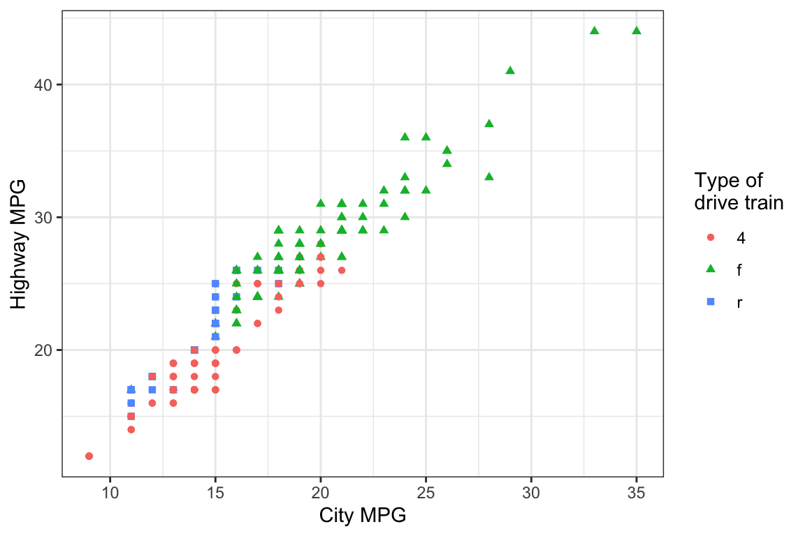
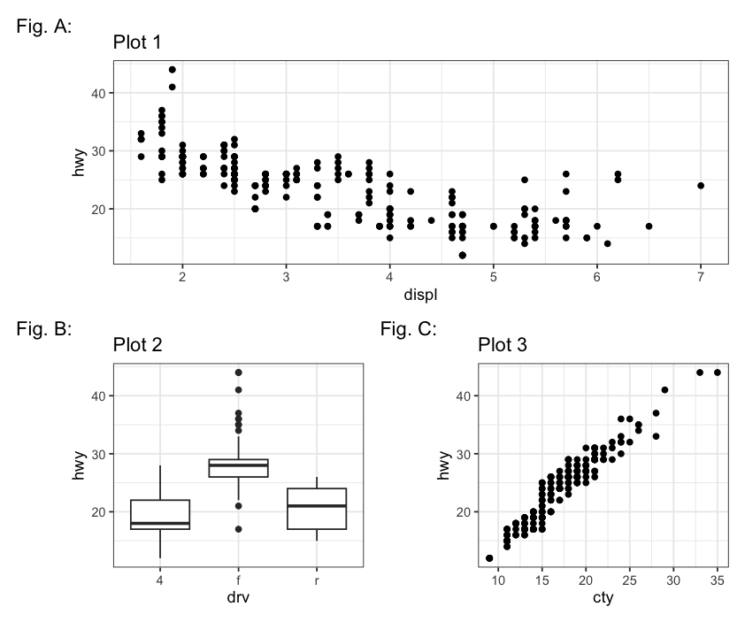
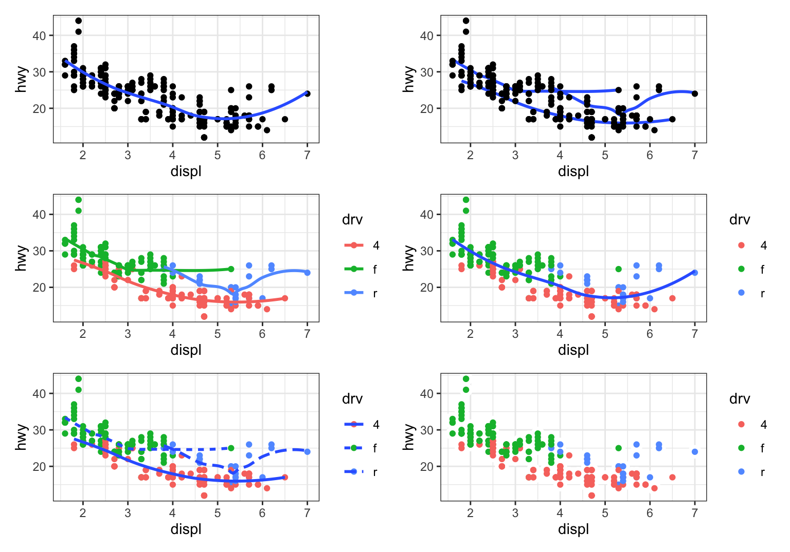

--- 
title: "2024_r4ds-ggplot2-answers" 
knit: "bookdown::render_book"
output:
  bookdown::gitbook: 
      number_sections: true
date: "`r Sys.Date()`" 
link-citations: yes 
github-repo: gurinina/2024_r4ds-ggplot2-answers 
url: https\://bookdown.org/ggiaever/2024_r4ds-ggplot2-answers 
site: bookdown::bookdown_site 
documentclass: book
cover-image: "images/koos10.png"
---

# R for data science workshop {-}

This website us the ggplot visulization sections of Hadley Wickham's book [2nd edition of "R for Data Science"](https://r4ds.hadley.nz/).


<!--chapter:end:index.Rmd-->

# Communication {#sec-communication}
Total points: 49

```{r setup global preferences}
source("_common.R")
```

## Introduction

For publishing purposes, you need to *communicate* your understanding to others.
Your audience will likely not share your background knowledge and will not be deeply invested in the data.
To help others quickly build up a good mental model of the data, you will need to invest considerable effort in making your plots as self-explanatory as possible.
In this chapter, you'll learn some of the tools that ggplot2 provides to do so.

This chapter focuses on the tools you need to create good graphics.
We assume that you know what you want, and just need to know how to do it.
For that reason, we highly recommend pairing this chapter with a good general visualization book.
We particularly like [The Truthful Art](https://www.amazon.com/gp/product/0321934075/), by Albert Cairo.
It doesn't teach the mechanics of creating visualizations, but instead focuses on what you need to think about in order to create effective graphics.

### Prerequisites

In this chapter, we'll focus once again on ggplot2.
We'll also use a little **dplyr** for data manipulation, **scales** to override the default breaks, labels, transformations and palettes, and a few ggplot2 extension packages, including **ggrepel** ([https://ggrepel.slowkow.com](https://ggrepel.slowkow.com/)) by Kamil Slowikowski and **patchwork** ([https://patchwork.data-imaginist.com](https://patchwork.data-imaginist.com/)) by Thomas Lin Pedersen.
Don't forget that you'll need to install those packages with `install.packages()` if you don't already have them.

Uncomment the following line if you need to install any of these packages (you should have `tidyverse`:

```{r}
# install.packages(c("ggrepel","scales","ggthemes"))
```


```{r}
#| label: setup

library(tidyverse)
library(scales)
library(ggrepel)
library(patchwork)
library(ggthemes)
```

## Labels

The easiest place to start when turning an exploratory graphic into an expository graphic is with good labels.
You add labels with the `labs()` function.

```{r}

#| fig-alt: |
#|   Scatterplot of highway fuel efficiency versus engine size of cars, where 
#|   points are colored according to the car class. A smooth curve following 
#|   the trajectory of the relationship between highway fuel efficiency versus 
#|   engine size of cars is overlaid. The x-axis is labelled "Engine 
#|   displacement (L)" and the y-axis is labelled "Highway fuel economy (mpg)". 
#|   The legend is labelled "Car type". The plot is titled "Fuel efficiency 
#|   generally decreases with engine size". The subtitle is "Two seaters 
#|   (sports cars) are an exception because of their light weight" and the 
#|   caption is "Data from fueleconomy.gov".

ggplot(mpg, aes(x = displ, y = hwy)) +
  geom_point(aes(color = class)) +
  geom_smooth(se = FALSE) +
  labs(
    x = "Engine displacement (L)",
    y = "Highway fuel economy (mpg)",
    color = "Car type",
    title = "Fuel efficiency generally decreases with engine size",
    subtitle = "Two seaters (sports cars) are an exception because of their light weight",
    caption = "Data from fueleconomy.gov"
  )
```

The purpose of a plot title is to summarize the main finding.
Avoid titles that just describe what the plot is, e.g., "A scatterplot of engine displacement vs. fuel economy".

If you need to add more text, there are two other useful labels: `subtitle` adds additional detail in a smaller font beneath the title and `caption` adds text at the bottom right of the plot, often used to describe the source of the data.
You can also use `labs()` to replace the axis and legend titles. Note the replacement of the legend title by "Car type" in the previous plot. It's usually a good idea to replace short variable names with more detailed descriptions, and to include the units.

It's possible to use mathematical equations instead of text strings.
Just switch `""` out for `quote()` and read about the available options in `?plotmath`:

```{r}
#| fig-asp: 1
#| out-width: "50%"
#| fig-width: 3
#| fig-alt: |
#|   Scatterplot with math text on the x and y axis labels. X-axis label 
#|   says x_i, y-axis label says sum of x_i  squared, for i from 1 to n.


df <- tibble(x = 1:10,
             y = cumsum(x ^ 2))

ggplot(df, aes(x, y)) +
  geom_point() +
  labs(x = quote(x[i]),
       y = quote(sum(x[i] ^ 2, i == 1, n)))
```

### Exercises 1.2.1 {.unnumbered}

1. Create a boxplot on the fuel economy data with x = `hwy` and y = `class` with a customized `title`, `subtitle`, `caption`, `x`, `y`, and `color` labels. 8pts


<div class="fold s o">

**Ans-1.2.1.1:**
```{r Ans-1.2.1.1}


ggplot(
  data = mpg,
  mapping = aes(x = class, y = hwy, fill = class)) +
  geom_boxplot() + 
  labs(
    title = "Compact Cars have > 10 Hwy MPG than Pickup Trucks",
    subtitle = "Comparing the median highway mpg in each class",
    caption = "Data from fueleconomy.gov",
    x = "Car Class",
    y = "Highway Miles per Gallon",
    fill = "car class"
  )
```

</div>

2. Recreate the following plot using the fuel economy data.
    Note that both the colors and shapes of points vary by type of drive train. 6pts


```{r}
#| label: fuel-economy
#| echo: false
#| fig-cap: Scatterplot of highway versus city fuel efficiency.


```


<div class="fold s o">
**Ans-1.2.1.2:**
```{r Ans-1.2.1.2}
    #| echo: false
    #| fig-alt: |
    #|   Scatterplot of highway versus city fuel efficiency. Shapes and 
    #|   colors of points are determined by type of drive train.

ggplot(mpg, aes(
  x = cty,
  y = hwy,
  color = drv,
  shape = drv
)) +
  geom_point() +
  labs(
    x = "City MPG",
    y = "Highway MPG",
    shape = "Type of\ndrive train",
    color = "Type of\ndrive train"
  )
```
</div>


## Annotations

In addition to labelling major components of your plot, it's often useful to label individual observations or groups of observations.
The first tool you have at your disposal is `geom_text()`.
`geom_text()` is similar to `geom_point()`, but it has an additional aesthetic: `label`.
This makes it possible to add textual labels to your plots.

There are two possible sources of labels.
First, you might have a tibble that provides labels.
In the following plot we pull out the cars with the highest engine size in each drive type and save their information as a new data frame called `label_info`.

```{r}

# slice_head operates by group, so when n = 1 it means the size of the group
# case_when where the left hand side determines which values match this case and the right hand side provides the replacement value.

label_info <- mpg |>
  group_by(drv) |>
  arrange(desc(displ)) |>
  slice_head(n = 1) |>
  mutate(
    drive_type = case_when(
      drv == "f" ~ "front-wheel drive",
      drv == "r" ~ "rear-wheel drive",
      drv == "4" ~ "4-wheel drive"
    )
  ) |>
  select(displ, hwy, drv, drive_type)

label_info
```
**Notice that `displ` values in `label_info` have captured the right-most point for each drive type.**

Then, we use this new data frame to directly label the three groups to replace the legend with labels placed directly on the plot.
Using the `fontface` and `size` arguments we can customize the look of the text labels.
They're larger than the rest of the text on the plot and bolded.
(`theme(legend.position = "none"`) turns all the legends off --- we'll talk about it more shortly.)

```{r}
#| fig-alt: |
#|   Scatterplot of highway mileage versus engine size where points are colored 
#|   by drive type. Smooth curves for each drive type are overlaid. 
#|   Text labels identify the curves as front-wheel, rear-wheel, and 4-wheel.

ggplot(mpg, aes(x = displ, y = hwy, color = drv)) +
  geom_point(alpha = 0.3) +
  geom_smooth(se = FALSE) +
  geom_text(
    data = label_info,
    aes(x = displ, y = hwy, label = drive_type),
    fontface = "bold",
    size = 5,
    hjust = "right",
    vjust = "bottom"
  ) +
  theme(legend.position = "none")
```
**Once you see the placement you can use `nudge_x` and `nudge_y` to set it so that it doesn't overlap.**

Note the use of `hjust` (horizontal justification) and `vjust` (vertical justification) to control the alignment of the label.

However the annotated plot we made above is hard to read because the labels overlap with each other, and with the points.
We can use the `geom_label_repel()` function from the ggrepel package to address both of these issues.
This useful package will automatically adjust labels so that they don't overlap:

```{r}
#| fig-alt: |
#|   Scatterplot of highway fuel efficiency versus engine size of cars, where 
#|   points are colored according to the car class. Some points are labelled 
#|   with the car's name. The labels are box with white, transparent background 
#|   and positioned to not overlap.

ggplot(mpg, aes(x = displ, y = hwy, color = drv)) +
  geom_point(alpha = 0.3) +
  geom_smooth(se = FALSE) +
  geom_label_repel(
    data = label_info,
    aes(x = displ, y = hwy, label = drive_type),
    fontface = "bold",
    size = 5,
    nudge_y = 2
  ) +
  theme(legend.position = "none")
```

You can also use the same idea to highlight certain points on a plot with `geom_text_repel()` from the ggrepel package.
Note another handy technique used here: we added a second layer of large, hollow points to further highlight the labelled points.

```{r}
#| fig-alt: |
#|   Scatterplot of highway fuel efficiency versus engine size of cars. Points 
#|   where highway mileage is above 40 as well as above 20 with engine size 
#|   above 5 are red, with a hollow red circle, and labelled with model name 
#|   of the car.

potential_outliers <- mpg |>
  filter(hwy > 40 | (hwy > 20 & displ > 5))
  
ggplot(mpg, aes(x = displ, y = hwy)) +
  geom_point() +
  geom_text_repel(data = potential_outliers, aes(label = model)) +
  geom_point(data = potential_outliers, color = "red") +
  geom_point(
    data = potential_outliers,
    color = "red", size = 3, shape = "circle open"
  )
```

Remember, in addition to `geom_text()` and `geom_label()`, you have many other geoms in ggplot2 available to help annotate your plot.
A couple ideas:

-   Use `geom_hline()` and `geom_vline()` to add reference lines.
    We often make them thick (`linewidth = 2`) and white (`color = white`), and draw them underneath the primary data layer.
    That makes them easy to see, without drawing attention away from the data.

-   Use `geom_rect()` to draw a rectangle around points of interest.
    The boundaries of the rectangle are defined by aesthetics `xmin`, `xmax`, `ymin`, `ymax`.
    
-   Use `geom_segment()` with the `arrow` argument to draw attention to a point with an arrow.
    Use aesthetics `x` and `y` to define the starting location, and `xend` and `yend` to define the end location.

Another handy function for adding annotations to plots is `annotate()`.
As a rule of thumb, geoms are generally useful for highlighting a subset of the data while `annotate()` is useful for adding one or few annotation elements to a plot.

To demonstrate using `annotate()`, let's create some text to add to our plot.
The text is a bit long, so we'll use `stringr::str_wrap()` to automatically add line breaks to it given the number of characters you want per line:

```{r}
trend_text <- "Larger engine sizes tend to have lower fuel economy." |> str_wrap(width = 30)

trend_text
```

Then, we add two layers of annotation: one with a label geom and the other with a segment geom.
The `x` and `y` aesthetics in both define where the annotation should start, and the `xend` and `yend` aesthetics in the segment annotation define the end location of the segment.
Note also that the segment is styled as an arrow.

```{r}
#| fig-alt: |
#|   Scatterplot of highway fuel efficiency versus engine size of cars. A red 
#|   arrow pointing down follows the trend of the points and the annotation 
#|   placed next to the arrow reads "Larger engine sizes tend to have lower 
#|   fuel economy". The arrow and the annotation text is red.

ggplot(mpg, aes(x = displ, y = hwy)) +
  geom_point() +
  annotate(
    geom = "label",
    x = 3.5,
    y = 38,
    label = trend_text,
    hjust = "left",
    color = "red"
  ) +
  annotate(
    geom = "segment",
    x = 3,
    y = 35,
    xend = 5,
    yend = 25,
    color = "red",
    arrow = arrow(type = "closed")
  )


```

Annotation is a powerful tool for communicating main takeaways and interesting features of your visualizations.
The only limit is your imagination (and your patience with positioning annotations to be aesthetically pleasing)!

### Exercises 1.3.1 {.unnumbered}

1. Use `geom_text()` with infinite positions to place text at the four corners of the plot. **Hint: construct a `data.frame` similar to `label_info` with `hjust` and `vjust` and to set the coordinate positions.** 2pts

<div class="fold s o">
**Ans-1.3.1.1:**
```{r Ans-1.3.1.1}

# We can use similar code as the example in the text. However, I need to use `vjust` and `hjust` in order for the text to appear in the plot, and these need to be different for each corner. But, `geom_text()` takes `hjust` and `vjust` as aesthetics, I can add them to the data and mappings, and use a single `geom_text()` call instead of four different `geom_text()` calls with four different data arguments, and four different values of `hjust` and `vjust` arguments.

label <- tibble(
  displ = c(Inf, Inf, -Inf, -Inf),
  hwy = c(Inf, -Inf, Inf, -Inf),
  label = c("Top right", "Bottom right", "Top left", "Bottom left"),
  vjust = c("top", "bottom", "top", "bottom"),
  hjust = c("right", "right", "left", "left")
)

ggplot(mpg, aes(displ, hwy)) +
  geom_point() +
  geom_text(aes(
    x = displ,
    y = hwy,
    label = label,
    vjust = vjust,
    hjust = hjust
  ),
  data = label)
```
</div>


2. Use `annotate()` to add a point geom in the middle of the following plot without having to create a tibble. Customize the shape, size, or color of the point. 2pts

```{r}
ggplot(mpg, aes(displ, hwy)) +
  geom_point() 
```

    
<div class="fold s o">
**Ans-1.3.1.2:**
```{r Ans-1.3.1.2}

ggplot(mpg, aes(displ, hwy)) + geom_point() +
  annotate(
    "point",
    x = 5,
    y = 35,
    color = "red",
    shape = 24,
    size = 5,
    fill = "blue"
  )


```
</div>

3.  
    a). How do labels with `geom_text()` interact with faceting? Try it by adding a geom_text element to: 2pts

```{r}

g <- ggplot(mpg, aes(displ, hwy)) + geom_point()
```
<div class="fold s o">

**Ans-1.3.1.3a:**
```{r Ans-1.3.1.3a}

#  If the facet variable is not specified, the text is drawn in all facets.

label <- tibble(displ = Inf,
                hwy = Inf,
                label = "Increasing engine size is \nrelated to decreasing fuel economy.")

g +  geom_text(
  aes(label = label),
  data = label,
  color = "red",
  vjust = "top",
  hjust = "right",
  size = 4
) + facet_wrap( ~ class)
```
</div>

    b) How can you add a label to a single facet? 2pts
    
<div class="fold s o">
**Ans-1.3.1.3b:**
```{r Ans-1.3.1.3b}

# To draw the label in only one facet, add a column to the label data frame with the value of the faceting variable(s) in which to draw it.

label <- tibble(
  displ = Inf,
  hwy = Inf,
  class = "2seater",
  label = "Increasing engine size is \nrelated to decreasing fuel economy."
)

ggplot(mpg, aes(displ, hwy)) +
  geom_point() +
  geom_text(
    aes(label = label),
    data = label,
    vjust = "top",
    hjust = "right",
    size = 3
  ) + facet_wrap( ~ class)
```
</div>

    c) How can you put a different label in each facet? (Hint: Think about the dataset that is being passed to `geom_text()`.) 2pts
    
<div class="fold s o">
**Ans-1.3.1.3c:**
```{r Ans-1.3.1.3c}

# To draw labels in different plots, simply have the faceting variable(s):

label <- tibble(
  displ = Inf,
  hwy = Inf,
  class = unique(mpg$class),
  label = paste0("Label for ", class)
)

ggplot(mpg, aes(displ, hwy)) +
  geom_point() +
  geom_text(aes(label = label),
            data = label, vjust = "top", hjust = "right",
            size = 3
  ) + facet_wrap(~class)
```
</div>

4.  What arguments to `geom_label()` control the appearance of the background box? 3pts

```{r, echo=FALSE}
library(details)
```

**Ans-1.3.1.4:**
```{details,details.summary = "Ans-1.3.1.4:",echo=F}
library(xfun)
print("
-   `label.padding`: padding around label\n
-   `label.r`: amount of rounding in the corners\n
-   `label.size`: size of label border")
```

5. What are the four arguments to `arrow()`?
    How do they work?
    Create a series of plots that demonstrate the most important options. 4pts

**Ans-1.3.1.5:**
```{r Ans-1.3.1.5}

print("
-   `angle` : angle of arrow head\n
-   `length` : length of the arrow head\n
-   `ends`: ends of the line to draw arrow head\n
-   `type`: '`'open'` or `'close'`: whether the arrow head is a closed or open triangle")

#type
ggplot(data=NULL)+
  annotate(
    geom = "segment",
    x = 1, y = 1, xend = 10, yend = 10, color = "hotpink",
    arrow = arrow(type = "closed")
  )+
  annotate(
    geom = "segment",
    x = 1, y = 2, xend = 9, yend = 10, color = "hotpink",
    arrow = arrow(type = "open")
  )

#angle
ggplot(data=NULL)+
  annotate(
    geom = "segment",
    x = 1, y = 1, xend = 10, yend = 10, color = "hotpink",
    arrow = arrow(angle = 1)
  )+
  annotate(
    geom = "segment",
    x = 1, y = 2, xend = 9, yend = 10, color = "hotpink",
    arrow = arrow(angle = 100)
  )

#length
ggplot(data=NULL)+
  annotate(
    geom = "segment",
    x = 1, y = 1, xend = 10, yend = 10, color = "hotpink",
    arrow = arrow(length = unit(0.1, "inches"))
  )+
  annotate(
    geom = "segment",
    x = 1, y = 2, xend = 9, yend = 10, color = "hotpink",
    arrow = arrow(length = unit(1, "inches"))
  )

#ends
ggplot(data=NULL)+
  annotate(
    geom = "segment",
    x = 1, y = 1, xend = 10, yend = 10, color = "hotpink",
    arrow = arrow(ends = "both")
  )+
  annotate(
    geom = "segment",
    x = 1, y = 2, xend = 9, yend = 10, color = "hotpink",
    arrow = arrow(ends = "last")
  )+
  annotate(
    geom = "segment",
    x = 2, y = 1, xend = 10, yend = 9, color = "hotpink",
    arrow = arrow(ends = "first")
  )
```

## Scales

The third way you can make your plot better for communication is to adjust the scales.
Scales control how the aesthetic mappings manifest visually.

### Default scales

Normally, ggplot2 automatically adds scales for you.
For example, when you type:

```{r results='hide'}
#| label: default-scales
#| fig-show: "hide"

ggplot(mpg, aes(x = displ, y = hwy)) +
  geom_point(aes(color = class))
```

ggplot2 automatically adds default scales behind the scenes:

```{r fig.show='hide'}
#| fig-show: "hide"

ggplot(mpg, aes(x = displ, y = hwy)) +
  geom_point(aes(color = class)) +
  scale_x_continuous() +
  scale_y_continuous() +
  scale_color_discrete()
```

Note the naming scheme for scales: `scale_` followed by the name of the aesthetic, then `_`, then the name of the scale.
The default scales are named according to the type of variable they align with: continuous, discrete, datetime, or date.
`scale_x_continuous()` puts the numeric values from `displ` on a continuous number line on the x-axis, `scale_color_discrete()` chooses colors for each of the `class` of car, etc.
There are lots of non-default scales which you'll learn about below.

The default scales have been carefully chosen to do a good job for a wide range of inputs.
Nevertheless, you might want to override the defaults for two reasons:

-   You might want to tweak some of the parameters of the default scale.
    This allows you to do things like change the breaks on the axes, or the key labels on the legend.

-   You might want to replace the scale altogether, and use a completely different algorithm.
    Often you can do better than the default because you know more about the data.

### Axis ticks and legend keys

Collectively axes and legends are called **guides**.
Axes are used for x and y aesthetics; legends are used for everything else.

There are two primary arguments that affect the appearance of the ticks on the axes and the keys on the legend: `breaks` and `labels`.
Breaks controls the position of the ticks, or the values associated with the keys.
Labels controls the text label associated with each tick/key.
The most common use of `breaks` is to override the default choice:

```{r}
#| fig-alt: |
#|   Scatterplot of highway fuel efficiency versus engine size of cars,
#|   colored by drive. The y-axis has breaks starting at 15 and ending at 40, 
#|   increasing by 5.

ggplot(mpg, aes(x = displ, y = hwy, color = drv)) +
  geom_point() +
  scale_y_continuous(breaks = seq(15, 40, by = 5)) 
```

You can use `labels` in the same way (a character vector the same length as `breaks`), but you can also set it to `NULL` to suppress the labels altogether.
This can be useful for maps, or for publishing plots where you can't share the absolute numbers.
You can also use `breaks` and `labels` to control the appearance of legends.
For discrete scales for categorical variables, `labels` can be a named list of the existing levels names and the desired labels for them.

```{r}
#| fig-alt: |
#|   Scatterplot of highway fuel efficiency versus engine size of cars, colored 
#|   by drive. The x and y-axes do not have any labels at the axis ticks. 
#|   The legend has custom labels: 4-wheel, front, rear.

ggplot(mpg, aes(x = displ, y = hwy, color = drv)) +
  geom_point() +
  scale_x_continuous(labels = NULL) +
  scale_y_continuous(labels = NULL) +
  scale_color_discrete(labels = c("4" = "4-wheel", "f" = "front", "r" = "rear"))
```

The `labels` argument coupled with labeling functions from the scales package is also useful for formatting numbers as currency, percent, etc.
The plot on the left shows default labeling with `label_dollar()` from the `scales` package, which adds a dollar sign as well as a thousand separator comma.
The plot on the right adds further customization by dividing dollar values by 1,000 and adding a suffix "K" (for "thousands") as well as adding custom breaks.
Note that `breaks` is in the original scale of the data.

```{r}

#| fig-width: 4
#| fig-alt: |
#|   Two side-by-side box plots of price versus cut of diamonds. The outliers 
#|   are transparent. On both plots the x-axis labels are formatted as dollars.
#|   The x-axis labels on the plot start at $0 and go to $15,000, increasing 
#|   by $5,000. The x-axis labels on the right plot start at $1K and go to 
#|   $19K, increasing by $6K. 

# Left-# Right
ggplot(diamonds, aes(x = price, y = cut)) +
  geom_boxplot(alpha = 0.05) +
  scale_x_continuous(labels = label_dollar()) + ggplot(diamonds, aes(x = price, y = cut)) +
  geom_boxplot(alpha = 0.05) +
  scale_x_continuous(
    labels = label_dollar(scale = 1 / 1000, suffix = "K"),
    breaks = seq(1000, 19000, by = 6000)
  )
```

Another handy label function is `label_percent()`:

```{r}
#| fig-alt: |
#|   Segmented bar plots of cut, filled with levels of clarity. The y-axis 
#|   labels start at 0% and go to 100%, increasing by 25%. The y-axis label 
#|   name is "Percentage".

ggplot(diamonds, aes(x = cut, fill = clarity)) +
  geom_bar(position = "fill") +
  scale_y_continuous(name = "Percentage", labels = label_percent())
```

Another use of `breaks` is when you have relatively few data points and want to highlight exactly where the observations occur.
For example, take this plot that shows when each US president started and ended their term.

```{r}
#| fig-alt: |
#|   Line plot of id number of presidents versus the year they started their 
#|   presidency. Start year is marked with a point and a segment that starts 
#|   there and ends at the end of the presidency. The x-axis labels are 
#|   formatted as two digit years starting with an apostrophe, e.g., '53.

# here `id` is the ordinal number of the president, e.g. Trump is in the 12th row + 33 = 45th president
presidential |> mutate(id = 33 + row_number()) |>
  ggplot(aes(x = start, y = id)) +
  geom_point() +
  geom_segment(aes(xend = end, yend = id)) +
  scale_x_date(name = NULL, breaks = presidential$start, date_labels = "'%y")
```

Note that for the `breaks` argument we pulled out the `start` variable as a vector with `presidential$start` because we can't do an aesthetic mapping for this argument.
Also note that the specification of breaks and labels for date and datetime scales is a little different:

-   `date_labels` takes a format specification, in the same form as `parse_datetime()`.

-   `date_breaks` (not shown here), takes a string like "2 days" or "1 month".

### Legend layout

You will most often use `breaks` and `labels` to tweak the axes.
While they both also work for legends, there are a few other techniques you are more likely to use.

To control the overall position of the legend, you need to use a `theme()` setting.
We'll come back to themes at the end of the chapter, but in brief, they control the non-data parts of the plot.
The theme setting `legend.position` controls where the legend is drawn:

```{r}
#| fig-width: 4
#| fig-alt: |
#|   Four scatterplots of highway fuel efficiency versus engine size of cars 
#|   where points are colored based on class of car. Clockwise, the legend 
#|   is placed on the right, left, top, and bottom of the plot.


base <- ggplot(mpg, aes(x = displ, y = hwy)) +
  geom_point(aes(color = class)) 

 # the default  right, then left
base + theme(legend.position = "right") +
base + theme(legend.position = "left") 

 # then top, then bottom
base + 
  theme(legend.position = "top") +
  guides(color = guide_legend(nrow = 3)) +
base + 
  theme(legend.position = "bottom") +
  guides(color = guide_legend(nrow = 3))
```

If your plot is short and wide, place the legend at the top or bottom, and if it's tall and narrow, place the legend at the left or right.
You can also use `legend.position = "none"` to suppress the display of the legend altogether.

To control the display of individual legends, use `guides()` along with `guide_legend()` or `guide_colorbar()`.
The following example shows two important settings: controlling the number of rows the legend uses with `nrow`, and overriding one of the aesthetics to make the points bigger.
This is particularly useful if you have used a low `alpha` to display many points on a plot.

```{r}
#| fig-alt: |
#|   Scatterplot of highway fuel efficiency versus engine size of cars 
#|   where points are colored based on class of car. Overlaid on the plot is a 
#|   smooth curve. The legend is in the bottom and classes are listed 
#|   horizontally in two rows. The points in the legend are larger than the points 
#|   in the plot.

ggplot(mpg, aes(x = displ, y = hwy)) +
  geom_point(aes(color = class)) +
  geom_smooth(se = FALSE) +
  theme(legend.position = "bottom") +
  guides(color = guide_legend(nrow = 2, override.aes = list(size = 4)))
```

Note that the name of the argument in `guides()` matches the name of the aesthetic, just like in `labs()`.

### Replacing a scale

Instead of just tweaking the details a little, you can instead replace the scale altogether.
There are two types of scales you're mostly likely to want to switch out: continuous position scales and color scales.
Fortunately, the same principles apply to all the other aesthetics, so once you've mastered position and color, you'll be able to quickly pick up other scale replacements.

It's very useful to plot transformations of your variable.
For example, it's easier to see the precise relationship between `carat` and `price` if we log transform them:

```{r}
#| fig-width: 7
#| fig-alt: |
#|   Two plots of price versus carat of diamonds. Data binned and the color of 
#|   the rectangles representing each bin based on the number of points that 
#|   fall into that bin. In the second plot, price and carat values 
#|   are logged and the axis labels shows the logged values.

# price vs. caret
ggplot(diamonds, aes(x = carat, y = price)) +
  geom_hex()

# log10 price vs log10 caret
ggplot(diamonds, aes(x = log10(carat), y = log10(price))) + geom_hex()
```

However, the disadvantage of this transformation is that the axes are now labelled with the transformed values, making it hard to interpret the plot.
Instead of doing the transformation in the aesthetic mapping, we can instead do it with the scale.
This is visually identical, except the axes are labelled on the original data scale.

```{r}
#| fig-alt: |
#|   Plot of price versus carat of diamonds. Data binned and the color of 
#|   the rectangles representing each bin based on the number of points that 
#|   fall into that bin. The axis labels are on the original data scale.

ggplot(diamonds, aes(x = carat, y = price)) +
  geom_hex() + 
  scale_x_log10() + 
  scale_y_log10()
```

Another scale that is frequently customized is color.
The default categorical scale picks colors that are evenly spaced around the color wheel.
Useful alternatives are the ColorBrewer scales which we have seen before and have been hand tuned to work better for people with common types of color blindness.
The two plots below look similar, but there is enough difference in the shades of red and green that the dots on the right can be distinguished even by people with red-green color blindness.[^communication-1]

[^communication-1]: You can use a tool like [SimDaltonism](https://michelf.ca/projects/sim-daltonism/) to simulate color blindness to test these images.

```{r}
#| fig-width: 8
#| fig-alt: |
#|   Two scatterplots of highway mileage versus engine size where points are 
#|   colored by drive type. The first plot uses the default 
#|   ggplot2 color palette and the plot on the right uses a different color 
#|   palette.

# default color palette
ggplot(mpg, aes(x = displ, y = hwy)) +
  geom_point(aes(color = drv)) 

# RColorBrewer palette
ggplot(mpg, aes(x = displ, y = hwy)) + geom_point(aes(color = drv)) + 
  scale_color_brewer(palette = "Set1")
```

Don't forget simpler techniques for improving accessibility.
If there are just a few colors, you can add a redundant shape mapping.
This will also help ensure your plot is interpretable in black and white.

```{r}
#| fig-alt: |
#|   Scatterplots of highway mileage versus engine size where both color 
#|   and shape of points are based on drive type. The color palette is not 
#|   the default ggplot2 palette.

ggplot(mpg, aes(x = displ, y = hwy)) +
  geom_point(aes(color = drv, shape = drv)) +
  scale_color_brewer(palette = "Dark2")
```

The ColorBrewer scales are documented online at <https://colorbrewer2.org/> and made available in R via the **RColorBrewer** package, by Erich Neuwirth.
\@ref(fig:fig-brewer) shows the complete list of all palettes.
The sequential (top) and diverging (bottom) palettes are particularly useful if your categorical values are ordered, or have a "middle".
This often arises if you've used `cut()` to make a continuous variable into a categorical variable.

```{r}
#| label: fig-brewer
#| echo: false
#| fig-cap: All colorBrewer scales.
#| fig-asp: 2.5
#| fig-alt: |
#|   All colorBrewer scales. One group goes from light to dark colors. 
#|   Another group is a set of non ordinal colors. And the last group has 
#|   diverging scales (from dark to light to dark again). Within each set 
#|   there are a number of palettes.

par(mar = c(0, 3, 0, 0))
RColorBrewer::display.brewer.all()
```

When you have a predefined mapping between values and colors, use `scale_color_manual()`.
For example, if we map presidential party to color, we want to use the standard mapping of red for Republicans and blue for Democrats.
One approach for assigning these colors is using hex color codes:

```{r}
#| fig-alt: |
#|   Line plot of id number of presidents versus the year they started their 
#|   presidency. Start year is marked with a point and a segment that starts 
#|   there and ends at the end of the presidency. Democratic presidents are 
#|   represented in blue and Republicans in red.

presidential |> mutate(id = 33 + row_number()) |>
  ggplot(aes(x = start, y = id, color = party)) +
  geom_point() +
  geom_segment(aes(xend = end, yend = id)) +
  scale_color_manual(values = c(Republican = "#E81B23", Democratic = "#00AEF3"))
```

For continuous color, you can use the built-in `scale_color_gradient()` or `scale_fill_gradient()`.
If you have a diverging scale, you can use `scale_color_gradient2()`.
That allows you to give, for example, positive and negative values different colors.
That's sometimes also useful if you want to distinguish points above or below the mean.

Another option is to use the viridis color scales.
The designers, Nathaniel Smith and Stéfan van der Walt, carefully tailored continuous color schemes that are perceptible to people with various forms of color blindness as well as perceptually uniform in both color and black and white.
These scales are available as continuous (`c`), discrete (`d`), and binned (`b`) palettes in ggplot2.

```{r}
#| fig-width: 6
#| fig-alt: |
#|  Three plots.
#|  The first plot uses the default, continuous 
#|  ggplot2 scale. 
#|  The second plot uses the viridis, continuous scale, and the 
#|  third plot uses the viridis, binned scale.

df <- tibble(
  x = rnorm(10000),
  y = rnorm(10000)
)

ggplot(df, aes(x, y, fill = x)) + geom_point(shape = 24, size = 3) +
  labs(title = "Default, continuous", x = NULL, y = NULL)
  
ggplot(df, aes(x, y, fill = x)) + geom_point(shape = 24, size = 3)  + scale_fill_viridis_c() +
  labs(title = "Viridis, continuous", x = NULL, y = NULL)

ggplot(df, aes(x, y, fill = x)) + geom_point(shape = 24, size = 3)  + scale_fill_viridis_b() 
  labs(title = "Viridis, binned", x = NULL, y = NULL)
```

Note that all color scales come in two varieties: `scale_color_*()` and `scale_fill_*()` for the `color` and `fill` aesthetics respectively (the color scales are available in both UK and US spellings).

### Zooming

There are three ways to control the plot limits:

1. Adjusting what data are plotted.
2. Setting the limits in each scale.
3.  Setting `xlim` and `ylim` in `coord_cartesian()`.

We'll demonstrate these options in a series of plots.
The plot on the left shows the relationship between engine size and fuel efficiency, colored by type of drive train.
The plot on the right shows the same variables, but subsets the data that are plotted.
Subsetting the data has affected the x and y scales as well as the smooth curve.

1. Adjusting what data are plotted:
```{r}
#| fig-width: 8
#| fig-alt: |
#|   On the left, scatterplot of highway mileage vs. displacement, with 
#|   displacement. The smooth curve overlaid shows a decreasing, and then 
#|   increasing trend, like a hockey stick. On the right, same variables 
#|   are plotted with displacement ranging only from 5 to 6 and highway 
#|   mileage ranging only from 10 to 25. The smooth curve overlaid shows a 
#|   trend that's slightly increasing first and then decreasing. 

# All data vs. subsetted data
ggplot(mpg, aes(x = displ, y = hwy)) +
  geom_point(aes(color = drv)) +
  geom_smooth() + mpg |>
  filter(displ >= 5 & displ <= 6 & hwy >= 10 & hwy <= 25) |>
  ggplot(aes(x = displ, y = hwy)) +
  geom_point(aes(color = drv)) +
  geom_smooth()
```

Let's compare these to the two plots below where the plot on the left sets the `limits` on individual scales and the plot on the right sets them in `coord_cartesian()`.
We can see that reducing the limits is equivalent to subsetting the data.
Therefore, to zoom in on a region of the plot, it's generally best to use `coord_cartesian()`. because it doesn't change the fitting of `geom_smooth`.

2. Setting the limits in each scale (left).
3.  Setting `xlim` and `ylim` in `coord_cartesian()` (right).
```{r}
#| fig-width: 8
#| fig-alt: |
#|   On the left, scatterplot of highway mileage vs. displacement, with 
#|   displacement ranging from 5 to 6 and highway mileage ranging from 
#|   10 to 25. The smooth curve overlaid shows a trend that's slightly 
#|   increasing first and then decreasing. On the right, the same variables 
#|   are plotted with the same limits, however the smooth curve overlaid
#|   shows a relatively flat trend with a slight increase at the end.


# Limiting scale (equivalent to subsetting) vs. zooming in on data
ggplot(mpg, aes(x = displ, y = hwy)) +
  geom_point(aes(color = drv)) +
  geom_smooth() +
  scale_x_continuous(limits = c(5, 6)) +
  scale_y_continuous(limits = c(10, 25)) + ggplot(mpg, aes(x = displ, y = hwy)) + geom_point(aes(color = drv)) +
  geom_smooth() +
  coord_cartesian(xlim = c(5, 6), ylim = c(10, 25))
```

On the other hand, setting the `limits` on individual scales is generally more useful if you want to *expand* the limits, e.g., to match scales across different plots.
For example, if we extract two classes of cars and plot them separately, it's difficult to compare the plots because all three scales (the x-axis, the y-axis, and the color aesthetic) have different ranges.

```{r}
#| fig-alt: |
#|   On the left, a scatterplot of highway mileage vs. displacement of SUVs.
#|   On the right, a scatterplot of the same variables for compact cars.
#|   Points are colored by drive type for both plots. Among SUVs more of
#|   the cars are 4-wheel drive and the others are rear-wheel drive, while
#|   among compact cars more of the cars are front-wheel drive and the others
#|   are 4-wheel drive. SUV plot shows a clear negative relationship
#|   between higway mileage and displacement while in the compact cars plot
#|   the relationship is much flatter.

suv <- mpg |> filter(class == "suv")
compact <- mpg |> filter(class == "compact")

# suv vs compact
ggplot(suv, aes(x = displ, y = hwy, color = drv)) +
  geom_point() + ggplot(compact, aes(x = displ, y = hwy, color = drv)) + geom_point()
```

One way to overcome this problem is to share scales across multiple plots, training the scales with the `limits` of the full data.

```{r}
#| fig-alt: |
#|   On the left, a scatterplot of highway mileage vs. displacement of SUVs.
#|   On the right, a scatterplot of the same variables for compact cars.
#|   Points are colored by drive type for both plots. Both plots are plotted 
#|   on the same scale for highway mileage, displacement, and drive type, 
#|   resulting in the legend showing all three types (front, rear, and 4-wheel 
#|   drive) for both plots even though there are no front-wheel drive SUVs and 
#|   no rear-wheel drive compact cars. Since the x and y scales are the same, 
#|   and go well beyond minimum or maximum highway mileage and displacement, 
#|   the points do not take up the entire plotting area.

x_scale <- scale_x_continuous(limits = range(mpg$displ))
y_scale <- scale_y_continuous(limits = range(mpg$hwy))
col_scale <- scale_color_discrete(limits = unique(mpg$drv))

# suv vs. compact on the same scale
ggplot(suv, aes(x = displ, y = hwy, color = drv)) +
  geom_point() +
  x_scale +
  y_scale +
  col_scale + ggplot(compact, aes(x = displ, y = hwy, color = drv)) +
  geom_point() +
  x_scale +
  y_scale +
  col_scale
```

In this particular case, you could have simply used faceting, but this technique is useful more generally, if for instance, you want to spread plots over multiple pages of a report.

### Exercises 1.4.6 {.unnumbered}

1. Why doesn't the following code override the default scale? Fix the plot so that it colors the points with a gradient set by `low = "yellow", high = "red"`. 2pts

```{r}
#| fig-show: "hide"

df <- tibble(x = rnorm(10000),
             y = rnorm(10000))

ggplot(df) +
  geom_point(aes(x = x, y = y,fill = x)) +
    scale_fill_gradient(low= "yellow", high = "red")
       
```
<div class="fold s o">

**Ans-1.4.1.1:**
```{r Ans-1.4.1.1}

# It does not override the default scale because the colors for the default point `shape = 19` ("filled circle") in `geom_point()` are set by the `color` aesthetic, not the `fill` aesthetic.

ggplot(df) +
  geom_point(aes(x = x, y = y, color = x)) +
    scale_color_gradient(low = "yellow", high = "red")
```
</div>

2. What is the first argument to every scale? How does it compare to `labs()`? 2pts
    
<div class="fold s o">
**Ans-1.4.1.2:**
```{r Ans-1.4.1.2}

# The first argument to every scale is the label for the scale. It is equivalent to using the `labs` function.


ggplot(mpg, aes(displ, hwy)) +
  geom_point(aes(colour = class)) +
  geom_smooth(se = FALSE) +
  labs(
    x = "Engine displacement (L)",
    y = "Highway fuel economy (mpg)",
    colour = "Car type"
  )

ggplot(mpg, aes(displ, hwy)) +
  geom_point(aes(colour = class)) +
  geom_smooth(se = FALSE) +
  scale_x_continuous("Engine displacement (L)") +
  scale_y_continuous("Highway fuel economy (mpg)") +
  scale_colour_discrete("Car type")
```
</div>

3. First, create the following plot. Then, modify the code using `override.aes` to make the legend easier to see. 2pts
```{r results='hide'}

#| fig-show: hide

ggplot(diamonds, aes(x = carat, y = price)) +
  geom_point(aes(color = cut), alpha = 1 / 20)
```

<div class="fold s o">
**Ans-1.4.1.3:**
```{r Ans-1.4.1.3}

# The problem with the legend is that the `alpha` value make the colors hard to see. So I'll override the alpha value to make the points solid in the legend.

ggplot(diamonds, aes(carat, price)) +
  geom_point(aes(colour = cut), alpha = 1 / 20) +
  theme(legend.position = "bottom") +
  guides(colour = guide_legend(nrow = 1, override.aes = list(alpha = 1)))
```
</div>

## Themes {#sec-themes}

Finally, you can customize the non-data elements of your plot with a theme:

```{r}

#| fig-alt: |
#|   Scatterplot of highway mileage vs. displacement of cars, colored by class
#|   of car. The plot background is white, with gray grid lines.

ggplot(mpg, aes(x = displ, y = hwy)) +
  geom_point(aes(color = class)) +
  geom_smooth(se = FALSE) +
  theme_classic()
```

ggplot2 includes the eight themes shown in \@ref(fig:fig-themes), with `theme_gray()` as the default.[^communication-2]
Many more are included in add-on packages like **ggthemes** (<https://jrnold.github.io/ggthemes>), by Jeffrey Arnold.
You can also create your own themes, if you are trying to match a particular corporate or journal style.

Many people wonder why the default theme has a gray background. This was a deliberate choice because it puts the data forward while still making the grid lines visible. The white grid lines are visible (which is important because they significantly aid position judgments), but they have little visual impact and we can easily tune them out. The gray background gives the plot a similar typographic color to the text, ensuring that the graphics fit in with the flow of a document without jumping out with a bright white background. Finally, the gray background creates a continuous field of color which ensures that the plot is perceived as a single visual entity.

```{r}
#| label: fig-themes
#| echo: false
#| fig-cap: The eight themes built-in to ggplot2.
#| fig-alt: |
#|   Eight barplots created with ggplot2, each 
#|   with one of the eight built-in themes: 
#|   theme_bw() - White background with grid lines,
#|   theme_light() - Light axes and grid lines,
#|   theme_classic() - Classic theme, axes but no grid
#|   lines, theme_linedraw() - Only black lines, 
#|   theme_dark() - Dark background for contrast, 
#|   theme_minimal() - Minimal theme, no background,
#|   theme_gray() - Gray background (default theme),
#|   theme_void() - Empty theme, only geoms are visible.

knitr::include_graphics("images/visualization-themes.png")
```

It's also possible to control individual components of each theme, like the size and color of the font used for the y axis.
We've already seen that `legend.position` controls where the legend is drawn.
There are many other aspects of the legend that can be customized with `theme()`.
For example, in the plot below we change the direction of the legend as well as put a black border around it.
Note that customization of the legend box and plot title elements of the theme are done with `element_*()` functions.
These functions specify the styling of non-data components, e.g., the title text is bolded in the `face` argument of `element_text()` and the legend border color is defined in the `color` argument of `element_rect()`.
The theme elements that control the position of the title and the caption are `plot.title.position` and `plot.caption.position`, respectively.
In the following plot these are set to `"plot"` to indicate these elements are aligned to the entire plot area, instead of the plot panel (the default).
A few other helpful `theme()` components are used to change the placement for format of the title and caption text.

```{r}
#| fig-alt: |
#|   Scatterplot of highway fuel efficiency versus engine size of cars, colored 
#|   by drive. The plot is titled 'Larger engine sizes tend to have lower fuel 
#|   economy' with the caption pointing to the source of the data, fueleconomy.gov.
#|   The caption and title are left justified, the legend is inside of the plot
#|   with a black border.

ggplot(mpg, aes(x = displ, y = hwy, color = drv)) +
  geom_point() +
  labs(
    title = "Larger engine sizes tend to have lower fuel economy",
    caption = "Source: https://fueleconomy.gov."
  ) +
  theme(
    legend.position = c(0.6, 0.7),
    legend.direction = "horizontal",
    legend.box.background = element_rect(color = "black"),
    plot.title = element_text(face = "bold"),
    plot.title.position = "plot",
    plot.caption.position = "plot",
    plot.caption = element_text(hjust = 0)
  )
```

For an overview of all `theme()` components, see help with `?theme`.
The [ggplot2 book](https://ggplot2-book.org/) is also a great place to go for the full details on theming.

### Exercises 1.5.1 {.unnumbered}

1. Pick a theme offered by the ggthemes package and apply it to this plot: 2pts

```{r}

#| fig-show: hide

ggplot(mpg, aes(x = displ, y = hwy, color = drv)) +
  geom_point() +
  labs(
    title = "Larger engine sizes tend to have lower fuel economy",
    caption = "Source: https://fueleconomy.gov."
  )
```

<div class="fold s o">
**Ans-1.5.1.1:**
```{r Ans-1.5.1.1}
ggplot(mpg, aes(x = displ, y = hwy, color = drv)) +
  geom_point() +
  labs(
    title = "Larger engine sizes tend to have lower fuel economy",
    caption = "Source: https://fueleconomy.gov."
  ) + theme_solarized()
```
</div>

2. Make the axis labels of your plot blue and bolded. 4pts


<div class="fold s o">
**Ans-1.5.1.2:**
```{r Ans-1.5.1.2}

ggplot(mpg, aes(x = displ, y = hwy, color = drv)) +
  geom_point() +
  labs(
    title = "Larger engine sizes tend to have lower fuel economy",
    caption = "Source: https://fueleconomy.gov.") + theme_solarized() + 
  theme(axis.text = element_text(color = "blue", face = "bold"))

```
</div>

## Layout

So far we talked about how to create and modify a single plot.
What if you have multiple plots you want to lay out in a certain way?
The patchwork package allows you to combine separate plots into the same graphic.
We loaded this package earlier in the chapter.

To place two plots next to each other, you can simply add them to each other.
Note that you first need to create the plots and save them as objects (in the following example they're called `p1` and `p2`).
Then, you place them next to each other with `+`.

```{r}
#| fig-asp: 0.5
#| fig-alt: |
#|   Two plots (a scatterplot of highway mileage versus engine size and a 
#|   side-by-side boxplots of highway mileage versus drive train) placed next 
#|   to each other.

p1 <- ggplot(mpg, aes(x = displ, y = hwy)) + 
  geom_point() + 
  labs(title = "Plot 1")
p2 <- ggplot(mpg, aes(x = drv, y = hwy)) + 
  geom_boxplot() + 
  labs(title = "Plot 2")

p1 + p2
```

You can also create complex plot layouts using `|` and `/`. In the following, `|` places the `p1` and `p3` next to each other and `/` moves `p2` to the next line.

```{r}
#| fig-asp: 0.8
#| fig-alt: |
#|   Three plots laid out such that first and third plot are next to each other 
#|   and the second plot stretched beneath them. The first plot is a 
#|   scatterplot of highway mileage versus engine size, third plot is a 
#|   scatterplot of highway mileage versus city mileage, and the third plot is 
#|   side-by-side boxplots of highway mileage versus drive train) placed next 
#|   to each other.

p3 <- ggplot(mpg, aes(x = cty, y = hwy)) +
  geom_point() +
  labs(title = "Plot 3")
(p1 | p3) / p2
```

Additionally, patchwork allows you to collect legends from multiple plots into one common legend, customize the placement of the legend as well as dimensions of the plots, and add a common title, subtitle, caption, etc. to your plots.
Below we create 5 plots.
We have turned off the legends on the box plots and the scatterplot and collected the legends for the density plots at the top of the plot with `& theme(legend.position = "top")`.
Note the use of the `&` operator here instead of the usual `+`.
This is because we're modifying the theme for the patchwork plot as opposed to the individual ggplots.
The legend is placed on top, inside the `guide_area()`.
Finally, we have also customized the heights of the various components of our patchwork -- the guide has a height of 1, the box plots 3, density plots 2, and the faceted scatterplot 4.
Patchwork divides up the area you have allotted for your plot using this scale and places the components accordingly.

```{r}
#| fig-width: 8
#| fig-asp: 1
#| fig-alt: |
#|   Five plots laid out such that first two plots are next to each other. Plots 
#|   three and four are underneath them. And the fifth plot stretches under them. 
#|   The patchworked plot is titled "City and highway mileage for cars with 
#|   different drive trains" and captioned "Source: https://fueleconomy.gov". 
#|   The first two plots are side-by-side box plots. Plots 3 and 4 are density 
#|   plots. And the fifth plot is a faceted scatterplot. Each of these plots show 
#|   geoms colored by drive train, but the patchworked plot has only one legend 
#|   that applies to all of them, above the plots and beneath the title.

p1 <- ggplot(mpg, aes(x = drv, y = cty, color = drv)) + 
  geom_boxplot(show.legend = FALSE) + 
  labs(title = "Plot 1")

p2 <- ggplot(mpg, aes(x = drv, y = hwy, color = drv)) + 
  geom_boxplot(show.legend = FALSE) + 
  labs(title = "Plot 2")

p3 <- ggplot(mpg, aes(x = cty, color = drv, fill = drv)) + 
  geom_density(alpha = 0.5) + 
  labs(title = "Plot 3")

p4 <- ggplot(mpg, aes(x = hwy, color = drv, fill = drv)) + 
  geom_density(alpha = 0.5) + 
  labs(title = "Plot 4")

p5 <- ggplot(mpg, aes(x = cty, y = hwy, color = drv)) + 
  geom_point(show.legend = FALSE) + 
  facet_wrap(~drv) +
  labs(title = "Plot 5")

(
  guide_area() / (p1 + p2) / (p3 + p4) / p5
) +
  plot_annotation(
    title = "City and highway mileage for cars with different drive trains",
    caption = "Source: https://fueleconomy.gov."
  ) +
  plot_layout(
    guides = "collect",
    heights = c(1, 3, 2, 4)
  ) &
  theme(legend.position = "top")
```

If you'd like to learn more about combining and layout out multiple plots with patchwork, we recommend looking through the guides on the package website: <https://patchwork.data-imaginist.com>.

### Exercises 1.6.1 {.unnumbered}

1. What happens if you omit the parentheses in the following plot layout. Try it. Can you explain why this happens? 2pts

```{r}
  

p1 <- ggplot(mpg, aes(x = displ, y = hwy)) +
  geom_point() +
  labs(title = "Plot 1")
p2 <- ggplot(mpg, aes(x = drv, y = hwy)) +
  geom_boxplot() +
  labs(title = "Plot 2")
p3 <- ggplot(mpg, aes(x = cty, y = hwy)) +
  geom_point() +
  labs(title = "Plot 3")

(p1 | p2) / p3
```

<div class="fold s o">
**Ans-1.6.1.1:**
```{r Ans-1.6.1.1}

# It plots the first plot in the left half of the plot window and the second and third plots in the right half of the plot window; top and bottom.
# This happens because the `/` takes precedence over the `+` or `|` statements, like they do in mathematics: 3 + 4/5 vs. (3 + 4)/5

p1 <- ggplot(mpg, aes(x = displ, y = hwy)) +
  geom_point() +
  labs(title = "Plot 1")
p2 <- ggplot(mpg, aes(x = drv, y = hwy)) +
  geom_boxplot() +
  labs(title = "Plot 2")
p3 <- ggplot(mpg, aes(x = cty, y = hwy)) +
  geom_point() +
  labs(title = "Plot 3")

p1 | p2 / p3
```
</div>

2. Using the three plots from the previous exercise, recreate the following patchwork. 4pts


```{r}
#| label: 3-plots
#| echo: false
#| fig-cap: Scatterplot of highway versus city fuel efficiency.


```

<div class="fold s o">
**Ans-1.6.1.2:**
```{r Ans-1.6.1.2}
#| fig-width: 8
#| fig-asp: 0.8
#| echo: false
#| fig-alt: |
#|   Three plots: Plot 1 is a scatterplot of highway mileage versus engine size.
#|   Plot 2 is side-by-side box plots of highway mileage versus drive train.
#|   Plot 3 is side-by-side box plots of city mileage versus drive train.
#|   Plots 1 is on the first row. Plots 2 and 3 are on the next row, each span
#|   half the width of Plot 1. Plot 1 is labelled "Fig. A", Plot 2 is labelled
#|   "Fig. B", and Plot 3 is labelled "Fig. C".

p1 / (p2 + p3) +
  plot_annotation(
    tag_levels = c("A"),
    tag_prefix = "Fig. ",
    tag_suffix = ":"
  )
```
</div>

## Summary

In this chapter you've learned about adding plot labels such as title, subtitle, caption as well as modifying default axis labels, using annotation to add informational text to your plot or to highlight specific data points, customizing the axis scales, and changing the theme of your plot.
You've also learned about combining multiple plots in a single graph using both simple and complex plot layouts.

While you've so far learned about how to make many different types of plots and how to customize them using a variety of techniques, we've barely scratched the surface of what you can create with ggplot2.
If you want to get a comprehensive understanding of ggplot2, we recommend reading the book, [*ggplot2: Elegant Graphics for Data Analysis*](https://ggplot2-book.org).
Other useful resources are the [*R Graphics Cookbook*](https://r-graphics.org) by Winston Chang and [*Fundamentals of Data Visualization*](https://clauswilke.com/dataviz/) by Claus Wilke.

<!--chapter:end:01-communication-answers.Rmd-->

# Layers
Total points: 71

```{r setup global options}
# setup global options
source("_common.R")
```

## Introduction

In this chapter, you'll expand on your ggplot2 foundation as you learn about the layered grammar of graphics.
We'll start with a deeper dive into aesthetic mappings, geometric objects, and facets.
Then, you will learn about statistical transformations ggplot2 makes under the hood when creating a plot.
These transformations are used to calculate new values to plot, such as the heights of bars in a bar plot or medians in a box plot.
You will also learn about position adjustments, which modify how geoms are displayed in your plots.

We will not cover every single function and option for each of these layers, but we will walk you through the most important and commonly used functionality provided by ggplot2 as well as introduce you to packages that extend ggplot2.

### Prerequisites

This chapter focuses on ggplot2.
To access the datasets, help pages, and functions used in this chapter, first install the packages `patchwork` and `ggridges` if you need to by uncommenting this code:

```{r}

# install.packages(c("patchwork","ggridges","scales))

```

Then load the `tidyverse`, `scales` and `patchwork` packages by into your session:

```{r}
library(tidyverse)
library(patchwork)
library(scales)
```

## Aesthetic mappings

The `mpg` data frame is bundled with the ggplot2 package and contains `r nrow(mpg)` observations on `r mpg %>% distinct(model) %>% nrow()` car models.

```{r}
#?mpg

nrow(mpg)

sapply(mpg,class)
```

Among the variables in `mpg` are:

1. `displ`: A car's engine size, in liters.
    A numerical variable.

2. `hwy`: A car's fuel efficiency on the highway, in miles per gallon (mpg).
    A car with a low fuel efficiency consumes more fuel than a car with a high fuel efficiency when they travel the same distance.
    A numerical variable.

3. `class`: Type of car.
    A categorical variable.

Let's start by visualizing the relationship between `displ` and `hwy` for various `classes` of cars.
We can do this with a scatterplot where the numerical variables are mapped to the `x` and `y` aesthetics and the categorical variable is mapped to an aesthetic like `color` or `shape`

```{r}
#| fig-width: 10
#| fig-asp: 0.4
#| fig-show: hold
#| fig-alt: |
#|   Two scatterplots next to each other, both visualizing highway fuel #|   efficiency versus engine size of cars and showing a negative 
#|   association. In the plot on the left class is mapped to the color 
#|   aesthetic, resulting in different colors for each class. 
#|   In the plot on the right class is mapped the shape aesthetic, 
#|   resulting in different plotting character shapes for each class,
#|   except for suv. Each plot comes with a legend that shows the 
#|   mapping between color or shape and levels of the class variable.

ggplot(mpg, aes(x = displ, y = hwy, color = class)) +
  geom_point() + ggplot(mpg, aes(x = displ, y = hwy, shape = class)) + geom_point() + plot_layout(ncol = 2)
```

Note the use of `plot_layout` from the `patchwork` package to layout the plots in two rows.
You can also use mathematical symbols to layout `ggplots`:

Use `+` to plot them side-by-side:

```{r}
#| fig-width: 10
#| fig-asp: 0.4
ggplot(mpg, aes(x = displ, y = hwy, color = class)) + geom_point() + ggplot(mpg, aes(x = displ, y = hwy, shape = class)) + geom_point() 
```

Use '/' to plot them in one column:

```{r}
#| fig-height: 10
#| fig.width: 7
#| out-width: "100%"

(ggplot(mpg, aes(x = displ, y = hwy, color = class)) + geom_point())/ (ggplot(mpg, aes(x = displ, y = hwy, shape = class)) + geom_point())
```

Notice that parentheses are required for this operation unless you first save the plots:

```{r}
#| fig.height: 10

p1 <- ggplot(mpg, aes(x = displ, y = hwy, color = class)) + geom_point()

p2 <- ggplot(mpg, aes(x = displ, y = hwy, shape = class)) + geom_point()

p1/p2

```

When `class` is mapped to `shape`, we get two warnings:

> 1: The shape palette can deal with a maximum of 6 discrete values because more than 6 becomes difficult to discriminate; you have 7.
> Consider specifying shapes manually if you must have them.
>
> 2: Removed 62 rows containing missing values (`geom_point()`).

Since `ggplot2` will only use six shapes at a time, by default, additional groups will go unplotted when you use the shape aesthetic.
The second warning is related -- there are 62 SUVs in the dataset and they're not plotted.

Similarly, we can map `class` to `size` or `alpha` aesthetics as well, which control the size and the transparency of the points, respectively.

```{r}
#| fig-width: 5
#| fig-alt: |
#|   Two scatterplots next to each other, both visualizing highway fuel 
#|   efficiency versus engine size of cars and showing a negative 
#|   association. In the first plot class is mapped to the size 
#|   aesthetic, resulting in different sizes for each class. 
#|   In the second plot class is mapped the alpha aesthetic, 
#|   resulting in different alpha (transparency) levels for each class. 
#|   Each plot comes with a legend that shows the mapping between size 
#|   or alpha level and levels of the class variable.

# class mapped to size
ggplot(mpg, aes(x = displ, y = hwy, size = class)) +
  geom_point() 

# class mapped to alpha
ggplot(mpg, aes(x = displ, y = hwy, alpha = class)) +
  geom_point() 
```

Both of these produce warnings as well:

> Using size for a discrete variable is not advised.
> Using alpha for a discrete variable is not advised.

Mapping an unordered discrete (categorical) variable (`class`) to an ordered aesthetic (`size` or `alpha`) is generally not a good idea because it implies a ranking that does not in fact exist.

Once you map an aesthetic, `ggplot2` takes care of the rest.
It selects a reasonable scale to use with the aesthetic, and it constructs a legend that explains the mapping between levels and values.
For x and y aesthetics, `ggplot2` does not create a legend, but it creates an axis line with tick marks and a label.
The axis line provides the same information as a legend; it explains the mapping between locations and values.

You can also set the visual properties of your `geom` manually as an argument of your `geom` function (*outside* of `aes()`) instead of relying on a variable mapping to determine the appearance.
For example, we can make all of the points in our plot blue:

```{r}
#| fig-alt: |
#|   Scatterplot of highway fuel efficiency versus engine size of cars 
#|   that shows a negative association. All points are blue.

ggplot(mpg, aes(x = displ, y = hwy)) + 
  geom_point(color = "blue") 
```

Here, the color doesn't convey information about a variable, but only changes the appearance of the plot.
You'll need to pick a value that makes sense for that aesthetic:

-   The name of a color as a character string, e.g., `color = "blue"`
-   The size of a point in mm, e.g., `size = 1`
-   The shape of a point as a number, e.g, `shape = 1`, as shown in \@ref(fig:fig-shapes).

```{r}
#| label: fig-shapes
#| echo: false
#| 
#| fig.asp: 0.364
#| fig-align: "center"
#| fig-cap: |
#|   R has 25 built-in shapes that are identified by numbers. There are some 
#|   seeming duplicates: for example, 0, 15, and 22 are all squares. The 
#|   difference comes from the interaction of the `color` and `fill` 
#|   aesthetics. The hollow shapes (0--14) have a border determined by `color`; 
#|   the solid shapes (15--20) are filled with `color`; the filled shapes 
#|   (21--24) have a border of `color` and are filled with `fill`. Shapes are 
#|   arranged to keep similar shapes next to each other.  
#| fig-alt: |
#|   Mapping between shapes and the numbers that represent them: 0 - square, 
#|   1 - circle, 2 - triangle point up, 3 - plus, 4 - cross, 5 - diamond, 
#|   6 - triangle point down, 7 - square cross, 8 - star, 9 - diamond plus, 
#|   10 - circle plus, 11 - triangles up and down, 12 - square plus, 
#|   13 - circle cross, 14 - square and triangle down, 15 - filled square, 
#|   16 - filled circle, 17 - filled triangle point-up, 18 - filled diamond, 
#|   19 - solid circle, 20 - bullet (smaller circle), 21 - filled circle blue, 
#|   22 - filled square blue, 23 - filled diamond blue, 24 - filled triangle 
#|   point-up blue, 25 - filled triangle point down blue.

shapes <- tibble(
  shape = c(0, 1, 2, 5, 3, 4, 6:19, 20, 21, 22, 23, 24),
  x = (0:24 %/% 5) / 2,
  y = (-(0:24 %% 5)) / 4
)
ggplot(shapes, aes(x, y)) + 
  geom_point(aes(shape = shape), size = 5, fill = "red") +
  geom_text(aes(label = shape), hjust = 0, nudge_x = 0.15) +
  scale_shape_identity() +
  expand_limits(x = 4.1) +
  scale_x_continuous(NULL, breaks = NULL) + 
  scale_y_continuous(NULL, breaks = NULL, limits = c(-1.2, 0.2)) + 
  theme_minimal() +
  theme(aspect.ratio = 1/2.75)
```

So far we have discussed aesthetics that we can map or set in a scatterplot, when using a point geom.
You can learn more about all possible aesthetic mappings in the aesthetic specifications vignette at <https://ggplot2.tidyverse.org/articles/ggplot2-specs.html>.

The specific aesthetics you can use for a plot depend on the geom you use to represent the data.
In the next section we dive deeper into geoms.

### 2.2.1 Exercises {.unnumbered}

1. Create a scatterplot of `hwy` vs. `displ` where the points are pink filled in triangles. 2pts

::: {.fold .s .o}
```{r Ans:2.2.1.1}

ggplot(mpg, aes(x = hwy, y = displ)) +
  geom_point(color = "pink", shape = "triangle")
```
:::

2. Why did the following code not result in a plot with blue points? 2pts

```{r}
#| fig-show: hide
#| fig-alt: |
#|   Scatterplot of highway fuel efficiency versus engine size of cars  
#|   that shows a negative association. All points are red and 
#|   the legend shows a red point that is mapped to the word blue.

ggplot(mpg) + 
  geom_point(aes(x = displ, y = hwy, color = "blue"))
```

::: {.fold .s .o}
**Ans-2.2.1.2:**

```{r Ans-2.2.1.2}
#| fig-show: hide

# Color should be set outside of the aesthetic mapping. If you check what's going inside aes(), you find displ (your x variable), and hwy (your y variable). How does "blue" fit in here? It actually doesn't. As "blue" (a string) doesn't exist in your dataframe, it's not applied to your plot as a new coloring aesthetic. Instead, it will only be added to your legend (here "blue" could have been any string).

ggplot(mpg) +
  geom_point(aes(x = displ, y = hwy), color = "blue")
```
:::

3. What does the `stroke` aesthetic do? What shapes does it work with? (Hint: use `?geom_point`) 2pts

::: {.fold .s .o}
**Ans-2.2.1.3:**

```{r Ans-2.2.1.3}
# Stroke controls the width of the edge/border of the points for shapes 21-24 (filled circle, square, triangle, and diamond)
 
ggplot(mpg) +  geom_point(
  aes(x = displ, y = hwy),
  shape = 24,
  fill = "red",
  color = "blue",
  stroke = 1
)

ggplot(mpg) +  geom_point(
  aes(x = displ, y = hwy),
  shape = 21,
  fill = "purple",
  color = "red",
  stroke = 2,
  size = 8
)
```
:::

4. What happens if you map an aesthetic to something other than a variable name, like `aes(color = displ < 5)`? Try it by adding color to the following plot: 2pts

```{r}
#| fig-show: hide

ggplot(mpg) + geom_point(aes(x = displ, y = hwy))
```

::: {.fold .s .o}
**Ans-2.2.1.4:**

```{r Ans-2.2.1.4}

# It creates a logical variable with values `TRUE` and `FALSE` for cars with displacement values below and above 5. In general, mapping an aesthetic to something other than a variable first evaluates that expression then maps the aesthetic to the outcome.

ggplot(mpg) + 
  geom_point(aes(x = displ, y = hwy, color = displ < 5)) 
```
:::

## Geometric objects

How are these two plots similar?

```{r}
#| fig-show: hide

ggplot(mpg, aes(x = displ, y = hwy)) +  geom_point()

ggplot(mpg, aes(x = displ, y = hwy)) + geom_smooth()
```

Both plots contain the same x variable, the same y variable, and both describe the same data.
But the plots are not identical.
Each plot uses a different geometric object, `geom`, to represent the data.
The first plot uses the point geom, and the plot on the second uses the smooth geom, a smooth line fitted to the data.

To change the geom in your plot, change the geom function that you add to `ggplot()`.
For instance, to make the plots above, you can use the following code:

```{r}
#| fig-width: 6
# point
ggplot(mpg, aes(x = displ, y = hwy)) + geom_point() 

# smooth
ggplot(mpg, aes(x = displ, y = hwy)) + geom_smooth()
```

Every geom function in ggplot2 takes a `mapping` argument, either defined locally in the geom layer or globally in the `ggplot()` layer.

However, not every aesthetic works with every geom.
You could set the shape of a point, but you couldn't set the "shape" of a line.
If you try, ggplot2 will silently ignore that aesthetic mapping.
On the other hand, you *could* set the `linetype` of a line.

`geom_smooth()` will draw a different line, with a different `linetype`, for each unique value of the variable that you map to `linetype`.

```{r}
#| fig-width: 6
#| fig-show: hold
#| fig-alt: |
#|   Two plots of highway fuel efficiency versus engine size of cars.
#|   The data are represented with smooth curves. In the first plot, three 
#|   smooth curves, all with the same linetype. In the second plot, three 
#|   smooth curves with different line types (solid, dashed, or long 
#|   dashed) for each type of drive train. In both plots, confidence 
#|   intervals around the smooth curves are also displayed.

# Top
ggplot(mpg, aes(x = displ, y = hwy, shape = drv)) + 
  geom_smooth()

# Bottom
ggplot(mpg, aes(x = displ, y = hwy, linetype = drv)) + 
  geom_smooth()
```

Here, `geom_smooth()` separates the cars into three lines based on their `drv` value, which describes a car's drive train.
One line describes all of the points that have a `4` value, one line describes all of the points that have an `f` value, and one line describes all of the points that have an `r` value.
Here, `4` stands for four-wheel drive, `f` for front-wheel drive, and `r` for rear-wheel drive.

**Notice there is no legend for the first plot because geometric smooth does not have a shape aesthetic.**

If this sounds strange, we can make it clearer by overlaying the lines on top of the raw data and then coloring everything according to `drv`.

```{r}
#| fig-width: 6
#| fig-alt: |
#|   A plot of highway fuel efficiency versus engine size of cars. The data 
#|   are represented with points (colored by drive train) as well as smooth 
#|   curves (where line type is determined based on drive train as well). 
#|   Confidence intervals around the smooth curves are also displayed.

ggplot(mpg, aes(x = displ, y = hwy, color = drv)) +
  geom_point() + geom_smooth(aes(linetype = drv))

```

Notice that this plot contains two geoms in the same graph.

Many geoms, like `geom_smooth()`, use a single geometric object to display multiple rows of data.
For these geoms, you can set the `group` aesthetic to a categorical variable to draw multiple objects.
ggplot2 will draw a separate object for each unique value of the grouping variable.

In practice, ggplot2 will automatically group the data for these geoms whenever you map an aesthetic to a discrete variable (as in the `linetype` example).

It is convenient to rely on this feature because the `group` aesthetic by itself does not add a legend or distinguishing features to the geoms.

If you place mappings in a geom function, ggplot2 will treat them as local mappings for the layer.
It will use these mappings to extend or overwrite the global mappings *for that layer only*.
This makes it possible to display different aesthetics in different layers.

```{r}
#| fig-alt: |
#|   Scatterplot of highway fuel efficiency versus engine size of cars, where 
#|   points are colored according to the car class. A smooth curve following 
#|   the trajectory of the relationship between highway fuel efficiency versus 
#|   engine size of cars is overlaid along with a confidence interval around it.

ggplot(mpg, aes(x = displ, y = hwy)) + 
  geom_point(aes(color = class)) + 
  geom_smooth()
```

You can use the same idea to specify different `data` for each layer.
Here, we use red points as well as open circles to highlight two-seater cars.
The local data argument in `geom_point()` overrides the global data argument in `ggplot()` for that layer only.

```{r}
#| fig-alt: |
#|   Scatterplot of highway fuel efficiency versus engine size of cars, where 
#|   points are colored according to the car class. A smooth curve following 
#|   the trajectory of the relationship between highway fuel efficiency versus 
#|   engine size of subcompact cars is overlaid along with a confidence interval 
#|   around it.

g <- ggplot(mpg, aes(x = displ, y = hwy)) +
  geom_point() +
  geom_point(data = mpg %>% filter(class == '2seater'),
             color = "red")

g + geom_point(
  data = mpg %>% filter(class == '2seater'),
  shape = "circle open",
  size = 3,
  color = "red"
)
```

Geoms are the fundamental building blocks of ggplot2.
You can completely transform the look of your plot by changing its geom, and different geoms can reveal different features of your data.
For example, the histogram and density plot below reveal that the distribution of highway mileage is bimodal and right skewed while the boxplot reveals two potential outliers.

```{r}
#| fig.width: 6
#| fig-alt: |
#|   Three plots: histogram, density plot, and box plot of highway
#|   mileage.
 
# histogram
ggplot(mpg, aes(x = hwy)) + geom_histogram(binwidth = 2)

# density
ggplot(mpg, aes(x = hwy)) + geom_density()

# boxplot
ggplot(mpg, aes(x = hwy)) + geom_boxplot()
```

ggplot2 provides more than 40 geoms but these don't cover all possible plots one could make.
If you need a different geom, we recommend looking into extension packages first to see if someone else has already implemented it (see <https://exts.ggplot2.tidyverse.org/gallery/> for a sampling).

For example, the **ggridges** package ([https://wilkelab.org/ggridges](https://wilkelab.org/ggridges/){.uri}) is useful for making ridgeline plots, which can be useful for visualizing the density of a numerical variable for different levels of a categorical variable.

In the following plot not only did we use a new geom (`geom_density_ridges()`), but we have also mapped the same variable to multiple aesthetics (`drv` to `y`, `fill`, and `color`) as well as set an aesthetic (`alpha = 0.5`) to make the density curves transparent.

```{r}
#| fig-width: 6
#| fig-height: 6
#| fig-alt: 
#|   Density curves for highway mileage for cars with rear wheel, 
#|   front wheel, and 4-wheel drives plotted separately. The 
#|   distribution is bimodal and roughly symmetric for real and 
#|   4 wheel drive cars and unimodal and right skewed for front 
#|   wheel drive cars.

library(ggridges)

ggplot(mpg, aes(x = hwy, y = drv, fill = drv, color = drv)) +
  geom_density_ridges(alpha = 0.5, show.legend = FALSE)
```

The best place to get a comprehensive overview of all of the geoms ggplot2 offers, as well as all functions in the package, is the reference page: <https://ggplot2.tidyverse.org/reference>.
To learn more about any single geom, use the help (e.g., `?geom_smooth`).

### 2.3.1 Exercises {.unnumbered}

1.
    a) What geom would you use to draw a line chart? A boxplot? A histogram? An area chart? 4pts

```{r, echo = FALSE}
library(details)
```

```{details,details.summary = "Ans-2.3.1.1a:",echo = F}
library(stringr)
library(xfun)
raw_string(str_wrap("For a line chart you can use `geom_path()` or `geom_line()`. 
                    
For a boxplot you can use `geom_boxplot()`.

For a histogram, `geom_histogram()`.

For an area chart, `geom_area()`.", width = 80))

```

    b) Use the following ggplot to create 4 plots, `geom_line()`, `geom_boxplot()`, `geom_point()` and `geom_area()`. Include a title specifying the geometry for each. 4pts

```{r}
df <- data.frame(
  x = c(3, 1, 5), 
  y = c(2, 4, 6), 
  label = c("a","b","c")
)
p <- ggplot(df, aes(x, y, label = label))  
  
```

::: {.fold .s .o}
**Ans-2.3.1.1b:**

```{r Ans-2.3.1.1b}
#| fig-width: 5 # this means a height of 4
#| fig-align: "center" 

p + geom_line() + ggtitle("line")
p + geom_boxplot() + ggtitle("boxplot")
p + geom_point() + ggtitle("point")
p + geom_area() + ggtitle("area")
```
:::

2. Earlier in this chapter we used `show.legend` without explaining it:

```{r}
#| fig-show: hide
ggplot(mpg, aes(x = displ, y = hwy)) +
  geom_smooth(aes(color = drv), show.legend = FALSE)
```

What does `show.legend = FALSE` do here? What happens if you remove it? Try it. 2pts


::: {.fold .s .o}
**Ans-2.3.1.2:**

```{r Ans-2.3.1.2}
#| fig-width: 5
#| fig.align: "center" 
# It removes the legend for the geom it's specified in, in this case it removes the legend for the smooth lines that are colored based on `drv`.
# 
# If you remove `show.legend`, it will show the legend as show.legend = T is the default.

ggplot(mpg, aes(x = displ, y = hwy)) +
  geom_smooth(aes(color = drv))
```
:::

3. What does the `se` argument to `geom_smooth()` do? 2pts

```{details, details.summary = "Ans-2.3.1.3:",echo=F}
library(xfun)
raw_string(str_wrap('It displays the confidence interval around the smooth line.\n You can remove this with `se = FALSE`.'))
```

4. Recreate the R code necessary to generate and save the following graph \@ref(fig:6-plots) and arrange them in a figure with 2 columns. Note that wherever a categorical variable is used in the plot, it's `drv`. Use the mathematical notation in one, and the function from `patchwork`, `plot_layout` in another for laying out the plot. 7pts

```{r}
#| label: 6-plots
#| echo: false
#| out-width: "100%"
#| fig-cap: |
#|   Six plots arranged in two columns
#| fig-alt: |
#|   There are six scatterplots in this figure, arranged in a 3x2 grid. 
#|   In all plots highway fuel efficiency of cars are on the y-axis and 
#|   engine size is on the x-axis. The **first** plot shows all points in black
#|   with a smooth curve overlaid on them. In the **second** plot points are 
#|   also all black, with separate smooth curves overlaid for each level of 
#|   drive train. On the **third** plot, points and the smooth curves are 
#|   represented in different colors for each level of drive train. In the 
#|   **fourth** plot the points are represented in different colors for each 
#|   level of drive train but there is only a single smooth line fitted to 
#|   the whole data. In the **fifth** plot, points are represented in different
#|   colors for each level of drive train, and a separate smooth curve with 
#|   line types are fitted to each level of drive train. And 
#|   finally in the **sixth** plot points are represented in different colors 
#|   for each level of drive train and they have a thick white border.


```

::: {.fold .s .o}
**Ans-2.3.1.4:**

```{r, Ans-2.3.1.4}

p1 <- ggplot(mpg, aes(x = displ, y = hwy)) + 
      geom_point() + 
      geom_smooth(se = FALSE)
p2 <- ggplot(mpg, aes(x = displ, y = hwy)) + 
      geom_smooth(aes(group = drv), se = FALSE) +
      geom_point()
p3 <- ggplot(mpg, aes(x = displ, y = hwy, color = drv)) + 
      geom_point() + 
      geom_smooth(se = FALSE)
p4 <- ggplot(mpg, aes(x = displ, y = hwy)) + 
      geom_point(aes(color = drv)) + 
      geom_smooth(se = FALSE)
p5 <- ggplot(mpg, aes(x = displ, y = hwy)) + 
      geom_point(aes(color = drv)) +
      geom_smooth(aes(linetype = drv), se = FALSE)
p6 <- ggplot(mpg, aes(x = displ, y = hwy)) + 
      geom_point(size = 4, color = "white") + 
      geom_point(aes(color = drv)) 
    
    
# Combine the plots
    
(p1 + p2) / (p3 + p4) / (p5 + p6)
    
# OR

library(patchwork)
p1 + p2 + p3 + p4 + p5 + p6 +
  plot_layout(ncol = 2)

```
:::

**Notice the plots don't line up as nicely if you don't use the `plot_layout` function from patchwork because of the figure legends.**

## Facets

Another way, which is particularly useful for categorical variables, is to split your plot into **facets**, subplots that each display one subset of the data.

To facet your plot by a single variable, use `facet_wrap()`.
The first argument of `facet_wrap()` is a formula, which you create with `~` followed by a variable name.
The variable that you pass to `facet_wrap()` should be categorical.

Here "formula" is the name of the thing created by `~`, not a synonym for "equation".

```{r}
#| fig-width: 7
#| fig-alt: |
#|   Scatterplot of highway fuel efficiency versus engine size of cars, 
#|   faceted by class, with facets spanning two rows.

ggplot(mpg, aes(x = displ, y = hwy)) + 
  geom_point() + 
  facet_wrap(~cyl)
```

To facet your plot with the combination of two variables, switch from `facet_wrap()` to `facet_grid()`.
The first argument of `facet_grid()` is also a formula, but now it's a double sided formula: `rows ~ cols`.

```{r}
#| fig-width: 6
#| fig-alt: |
#|   Scatterplot of highway fuel efficiency versus engine size of cars, faceted 
#|   by number of cylinders across rows and by type of drive train across 
#|   columns. This results in a 4x3 grid of 12 facets. Some of these facets have 
#|   no observations: 5 cylinders and 4 wheel drive, 4 or 5 cylinders and front 
#|   wheel drive.

ggplot(mpg, aes(x = displ, y = hwy)) + 
  geom_point() + 
  facet_grid(drv ~ cyl)
```

The first argument in `facet_grid` determines the faceting by column, the second by row.
By default each of the facets share the same scale and range for x and y axes.

This is useful when you want to compare data across facets but it can be limiting when you want to visualize the relationship within each facet better.

Setting the `scales` argument in a faceting function to `"free"` will allow for different axis scales across both rows and columns, `"free_x"` will allow for different scales across rows, and `"free_y"` will allow for different scales across columns.

```{r}
#| fig-width: 6
#| fig-alt: |
#|   Scatterplot of highway fuel efficiency versus engine size of cars, 
#|   faceted by number of cylinders across rows and by type of drive train 
#|   across columns. This results in a 4x3 grid of 12 facets. Some of these 
#|   facets have no observations: 5 cylinders and 4 wheel drive, 4 or 5 
#|   cylinders and front wheel drive. Facets within a row share the same 
#|   y-scale and facets within a column share the same x-scale.

ggplot(mpg, aes(x = displ, y = hwy)) + 
  geom_point() + 
  facet_grid(drv ~ cyl, scales = "free_y")
```

Modifying facet label appearance:

```{r}
#| fig-width: 5

ggplot(mpg, aes(x = displ, y = hwy)) +
  geom_point() +
  facet_grid(drv ~ cyl) +
  theme(
    strip.text.x = element_text(
      size = 12,
      face = "bold",
      colour = "blue",
      angle = 75
    ),
    strip.text.y = element_text(
      size = 14,
      face = "bold",
      colour = "red"
    ),
    strip.background = element_rect(
      colour = "navy",
      fill = "#CCCCFF",
      linewidth  = 2
    )
  )
```

### 2.4.1 Exercises {.unnumbered}

1. What happens if you facet on a continuous variable? Try it on the. plot below and facet on `hwy`. 2pts

```{r}
#| fig-show: hide

ggplot(mpg, aes(x = drv, y = cyl)) + geom_point() 
     
```

::: {.fold .s .o}
**Ans-2.4.1.1:**

```{r Ans-2.4.1.1}

# Faceting by a continuous variable results in one facet per each unique value of the continuous variable. We can see this in the scatterplot below of `cyl` vs. `drv`, faceted by `hwy`.

ggplot(mpg, aes(x = drv, y = cyl)) + geom_point() +
  facet_wrap( ~ hwy)
```
:::

2. Run the following code and facet on drv vs cyl. What do the empty cells mean? 2pts

```{r}
#| fig-show: hide
ggplot(mpg) + geom_point(aes(x = drv, y = cyl))
```

::: {.fold .s .o}
**Ans-2.4.1.2:**

```{r Ans-2.4.1.2}
#| fig-width: 6.5

# There are no cars with rear-wheel drive and 5 cylinders, for example. Therefore the facet corresponding to that combination is empty. In general, empty facets mean no observations fall in that category.

ggplot(mpg) + geom_point(aes(x = drv, y = cyl)) +
  facet_grid(drv ~ cyl)
```
:::

3. What plots does the following code make? What does `.` do? 2pts

```{r}
#| fig-show: hide

ggplot(mpg) +
  geom_point(aes(x = displ, y = hwy)) +
  facet_grid(drv ~ .)

ggplot(mpg) +
  geom_point(aes(x = displ, y = hwy)) +
  facet_grid(. ~ cyl)
```

::: {.fold .s .o}
**Ans-2.4.1.3:**

```{r Ans-2.4.1.3}
#| fig-width: 6

# In the first plot, with `facet_grid(drv ~ .)`, the period means "don't facet across columns". In the second plot, with `facet_grid(. ~ drv)`, the period means "don't facet across rows". 


ggplot(mpg) +
  geom_point(aes(x = displ, y = hwy)) +
  facet_grid(drv ~ .)

ggplot(mpg) +
  geom_point(aes(x = displ, y = hwy)) +
  facet_grid(. ~ cyl)
```
:::

4. Take the first faceted plot in this section:

```{r}
#| fig-show: hide

ggplot(mpg) +
  geom_point(aes(x = displ, y = hwy)) +
  facet_wrap( ~ class, nrow = 2)
```

4. 
    a) What are the advantages to using faceting instead of the color aesthetic? What are the disadvantages? 2pts

```{details,details.summary = "Ans-2.4.1.4a:",echo=F}
library(stringr)
library(xfun)
raw_string(str_wrap("The advantages of faceting is seeing each class of car separately, without any overplotting. The disadvantage is not being able to compare the classes to each other as easily when they're in separate plots.Additionally, color can be helpful for easily telling classes apart. Using both can be helpful, but doesn't mitigate the issue of easy comparison across classes. If we were interested in a specific class, e.g. compact cars, it would be useful to highlight that group only with an additional layer as shown in the last plot below.", width = 80))
```

    b) What if you were interested in a specific class, e.g. compact cars? How would you highlight that group using only an additional layer added to the plot below? 2pts

```{r}
#| fig-show: hide

ggplot(mpg, aes(x = displ, y = hwy)) + geom_point(color = "pink") 
```

::: {.fold .s .o}
**Ans-2.4.1.4b:**

```{r Ans-2.4.1.4b}
#| fig-width: 7

#| fig.show='hold'

    # facet
ggplot(mpg) +
  geom_point(aes(x = displ, y = hwy)) +
  facet_wrap( ~ class, nrow = 2)

# color
ggplot(mpg) +
  geom_point(aes(x = displ, y = hwy, color = class))

# both

ggplot(mpg) +
  geom_point(aes(x = displ, y = hwy, color = class),
    show.legend = FALSE) +
    facet_wrap(~ class, nrow = 2)

# highlighting
ggplot(mpg, aes(x = displ, y = hwy)) +
  geom_point(color = "gray") +
  geom_point(data = mpg %>% filter(class == "compact"),
    color = "pink")
```
:::

5. Read `?facet_wrap`. What does `nrow` do? What does `ncol` do? What other options control the layout of the individual panels? Why doesn't `facet_grid()` have `nrow` and `ncol` arguments? 2pts

```{details,details.summary = "Ans-2.4.1.5:",echo = F}
library(stringr)
library(xfun)
raw_string(str_wrap("`nrow` controls the number panels and `ncol` controls the number of columns the panels should be arranged in.`facet_grid()` does not have these arguments because the number of rows and columns are determined by the number of levels of the two categorical variables. facet_grid()` plots. facet_wrap also has a `dir` argument which controls the whether the panels should be arranged horizontally or vertically.",width = 80))
```

6. Which of the following plots makes it easier to compare engine size (`displ`) across cars with different drive trains? What does this say about when to place a faceting variable across rows or columns? 2pts

```{r}
#| fig-show: hide

ggplot(mpg, aes(x = displ)) +
  geom_histogram() +
  facet_grid(drv ~ .)

ggplot(mpg, aes(x = displ)) +
  geom_histogram() +
  facet_grid(. ~ drv)
```

```{details,details.summary = "Ans-2.4.1.6:",echo=F}

raw_string(str_wrap("The first plot makes it easier to compare engine size (`displ`) across cars with different drive trains because the axis that plots `displ` is shared across the panels. What this says is that if the goal is to make comparisons based on a given variable, that variable should be placed on the shared axis.", width = 80))

```

7. Recreate the following plot using `facet_wrap()` instead of `facet_grid()`. How do the positions of the facet labels change? 2pts

```{r}
#| fig-width: 6
#| fig-height: 6

ggplot(mpg) +
  geom_point(aes(x = displ, y = hwy)) +
  facet_grid(drv ~ .)
```

::: {.fold .s .o}
**Ans-2.4.1.7:**

```{r, Ans:2.4.1.7}
#| fig-width: 6
#| fig-height: 6
#| fig-show: ='hold'
#| out-width: = "50%"

# The facet labels in `facet_grid` are on the side of each row, in `facet_wrap` the labels are on top of each row.

ggplot(mpg) +
  geom_point(aes(x = displ, y = hwy)) +
  facet_grid(drv ~ .)

ggplot(mpg) +
  geom_point(aes(x = displ, y = hwy)) +
  facet_wrap(drv ~ .)
```
:::

8. Modify the facet label in the following plot so that it has a background color of `navy` with a `red` outline and `white` text. 2pts

```{r}
#| fig-show: hide

ggplot(mpg) +
  geom_point(aes(x = displ, y = hwy)) +
  facet_grid(drv ~ .)
```

::: {.fold .s .o}
**Ans-2.4.1.8:**

```{r Ans-2.4.1.8}
#| fig-width: 6
#| fig-height: 6
#| out-width: = "80%"

ggplot(mpg) +
  geom_point(aes(x = displ, y = hwy)) +
  facet_grid(drv ~ .) +
  theme(
    strip.text.y = element_text(
      colour = "white"
    ),
    strip.background = element_rect(
      colour = "red",
      fill = "navy",
      linewidth  = 2
    )
  )
```
:::

## Statistical transformations

Consider a basic bar chart, drawn with `geom_bar()` or `geom_col()`.
The following chart displays the total number of diamonds in the `diamonds` dataset, grouped by `cut`.
The `diamonds` dataset is in the ggplot2 package and contains information on \~54,000 diamonds, including the `price`, `carat`, `color`, `clarity`, and `cut` of each diamond.
The chart shows that more diamonds are available with high quality cuts than with low quality cuts.

```{r}
#| fig-width: 6
#| fig-alt: |
#|   Bar chart of number of each cut of diamond. There are roughly 1500 
#|   Fair, 5000 Good, 12000 Very Good, 14000 Premium, and 22000 Ideal cut diamonds.

ggplot(diamonds, aes(x = cut)) + 
  geom_bar()
```

On the x-axis, the chart displays `cut`, a variable from `diamonds`.
On the y-axis, it displays count, but count is not a variable in `diamonds`!
Where does count come from?
Many graphs, like scatterplots, plot the raw values of your dataset.
Other graphs, like bar charts, calculate new values to plot:

-   Bar charts, histograms, and frequency polygons bin your data and then plot bin counts, the number of points that fall in each bin.

-   Smoothers fit a model to your data and then plot predictions from the model.

-   Boxplots compute the five-number summary of the distribution and then display that summary as a specially formatted box.

The algorithm used to calculate new values for a graph is called a **stat**, short for statistical transformation.
\@ref(fig:fig-vis-stat-bar) shows how this process works with `geom_bar()`.

```{r}
#| fig-width: 5
#| label: fig-vis-stat-bar
#| echo: false
#| fig-cap: |
#|   When creating a bar chart we first start with the raw data, then
#|   aggregate it to count the number of observations in each bar,
#|   and finally map those computed variables to plot aesthetics.
#| fig-alt: |
#|   A figure demonstrating three steps of creating a bar chart. 
#|   Step 1. geom_bar() begins with the diamonds data set. 
#|   Step 2. geom_bar() 
#|   transforms the data with the count stat, which returns a data set of 
#|   cut values and counts. 
#|   Step 3. geom_bar() uses the transformed data to 
#|   build the plot. cut is mapped to the x-axis, count is mapped to the y-axis.

knitr::include_graphics("images/visualization-stat-bar.png")
```

You can learn which stat a geom uses by inspecting the default value for the `stat` argument.
For example, `?geom_bar` shows that the default value for `stat` is "count", which means that `geom_bar()` uses `stat_count()`.
`stat_count()` is documented on the same page as `geom_bar()`.
If you scroll down, the section called "Computed variables" explains that it computes two new variables: `count` and `prop`.

Every geom has a default stat; and every stat has a default geom.
This means that you can typically use geoms without worrying about the underlying statistical transformation.
However, there are three reasons why you might need to use a stat explicitly:

1. You might want to override the default stat. In the code below, we change the stat of `geom_bar()` from count (the default) to identity.This lets us map the height of the bars to the raw values of a y variable.

```{r}
#| fig-width: 6
#| fig-alt: |
    #| Bar chart of number of each cut of diamond. There are roughly 1500 Fair, 5000 Good, 12000 Very Good, 14000 Premium, and 22000 Ideal cut diamonds.

diamonds %>%
  count(cut) %>%
  ggplot(aes(x = cut, y = n)) +
  geom_bar(stat = "identity")
```

2. You might want to override the default mapping from transformed variables to aesthetics. For example, you might want to display a bar chart of proportions, rather than counts:

```{r}
#| fig-width: 5
#| fig-alt: |
#|   Bar chart of proportion of each cut of diamond. Roughly, Fair 
#|   diamonds make up 0.03, Good 0.09, Very Good 0.22, Premium 0.26, and 
#|   Ideal 0.40.

ggplot(diamonds, aes(x = cut, y = after_stat(prop), group = 1)) +
  geom_bar()
```

To find the possible variables that can be computed by the stat, look for the section titled "computed variables" in the help for `geom_bar()`.

3. You might want to draw greater attention to the statistical transformation in your code. For example, you might use `stat_summary()`, which summarizes the y values for each unique x value, to draw attention to the summary that you're computing:

```{r}
#| fig-width: 5
#| fig-alt: |
#|   A plot with depth on the y-axis and cut on the x-axis (with levels 
#|   fair, good, very good, premium, and ideal) of diamonds. For each level 
#|   of cut, vertical lines extend from minimum to maximum depth for diamonds 
#|   in that cut category, and the median depth is indicated on the line 
#|   with a point.

ggplot(diamonds) +
  stat_summary(
    aes(x = cut, y = depth),
    fun.min = min,
    fun.max = max,
    fun = median
  ) 
```

ggplot2 provides more than 20 stats for you to use.
Each stat is a function, so you can get help in the usual way, e.g., `?stat_bin`.

### 2.5.1 Exercises {.unnumbered}

1. What is the default geom associated with `stat_summary()`? How could you rewrite the previous plot to use that geom function instead of the stat function? 2pts

::: {.fold .s}
**Ans-2.5.1.1:**

```{r Ans-2.5.1.1}
#| fig-width: 5

# The default geom of stat summary is `geom_pointrange()`.The plot can be recreated as follows.
diamonds %>%
  group_by(cut) %>%
  dplyr::summarize(
    lower = min(depth),
    upper = max(depth),
    midpoint = median(depth)
  ) %>%
  ggplot(aes(x = cut, y = midpoint)) +
  geom_pointrange(aes(ymin = lower, ymax = upper))
```
:::

2. 
    a) What does `geom_col()` do? How is it different from `geom_bar()`? 2pts

**Ans-2.5.1.2a:**
```{details,details.summary = "Ans-2.5.1.2a:",echo=F}

raw_string(str_wrap("

`geom_bar()` uses stat_count() by default: it counts the number of the number of occurrences for each x value or category. It doesn't expect a y-value, since it's going to count that up itself. 
                    
'geom_col' is the same as geom_bar(stat = 'identity'), so if your data contains groups x and the count for each group y, you can just use this function instead.

`geom_col()` can be used to make a bar plot from a data frame that represents a frequency table, while `geom_bar()` can be used to make a bar plot from a data frame where each row is an observation.", width = 80))

```

    b) Plot mpg and count the classes in drv. Compare `geom_bar` to `geom_col`. 2pts

::: {.fold .s .o}
**Ans-2.5.1.2b:**

```{r Ans-2.5.1.2b}
#| fig-width: 5

ggplot(mpg) + geom_bar(aes(fill = drv,x = class))

# OR

ggplot(mpg) + geom_bar(aes(fill = drv,x = class),position="dodge")


# `geom_col`

mpg %>%
group_by(class, .drop = FALSE) %>%  add_tally() %>% 
  ungroup()  %>% 
  ggplot(aes(fill = drv, x = class, y = n)) +
  geom_col()


```
:::

3. Most geoms and stats come in pairs that are almost always used in concert. Make a list of all the pairs. What do they have in common? (Hint: Read through the documentation.). Write the stat used for `geom_bar()`,`geom_smooth()` and `geom_boxplot()`. 3pts

```{details,details.summary = "Ans-2.5.1.3:",echo=F}

print("Geoms and stats that are almost always used in concert are listed below:


| **geom**                | **stat**                |
|-------------------------|-------------------------|
| `geom_bar()`            | `stat_count()`          |
| `geom_bin2d()`          | `stat_bin_2d()`         |
| `geom_boxplot()`        | `stat_boxplot()`        |
| `geom_count()`          | `stat_sum()`            |
| `geom_density()`        | `stat_density()`        |
| `geom_dotplot()`        | `stat_bindot()`         |
| `geom_function()`       | `stat_function()`       |
| `geom_smooth()`         | `stat_smooth()`         |
| `geom_violin()`         | `stat_ydensity()`       |
| `geom_hex()`            | `stat_bin_hex()`        |
| `geom_quantile()`       | `stat_quantile()`       |")
```

4. What variables does `stat_smooth()` compute? What arguments control its behavior? 2pts

```{details,details.summary = "Ans-2.5.1.4:",echo=F}

print("
-   `stat_smooth()` computes the following variables:\n
-   `y` or `x`: Predicted value\n
-   `ymin` or `xmin`: Lower pointwise confidence interval around the mean\n
-   `ymax` or `xmax`: Upper pointwise confidence interval around the mean\n
-   `se`: Standard error")
```


5. 
    a) In our proportion bar chart, we needed to set `group = 1`. Why? In other words, what is the problem with this graph? Replot using a `group` variable so that it plots correctly.

```{r}
#| fig-show: hide

ggplot(diamonds, aes(
  x = cut, y = after_stat(prop)
  )) + 
  geom_bar()

```

**Ans-2.5.1.5a:**

    b)  Replot the plot below without using a `group` aesthetic. Instead of using `after_stat(prop)` to calculate proportions use `after_stat(count)`. Label the y-axis using percentages. Hint: check out the scales package that we loaded.

```{r}
ggplot(diamonds, aes(
  x = cut, fill = color, y = after_stat(prop)
  )) + 
  geom_bar()
```


**Ans-2.5.1.5b:**

5. 
    a) In our proportion bar chart, we needed to set `group = 1`. Why? In other words, what is the problem with these two graphs? Replot the two plots below using a `group` variable so that it plots correctly. 2pts 
    
I mistakenly said:Replot the two plots below using `group = 1`.

```{r}
#|fig-show: hide

ggplot(diamonds, aes(
  x = cut, fill = color, y = after_stat(prop)
  )) + 
  geom_bar()

```

::: {.fold .s .o}
**Ans-2.5.1.5a:**

```{r Ans-2.5.1.5a}
#| fig-width: 6

# The problem with this plot is that the proportions are calculated by geom_bar within the cut categories so they will be equal to 1 (ie: what proportion of “Fair” is in “Fair”). By forcing the group to be 1, the proper proportions as part of the total number of observations will be displayed.

# Setting `group = 1` results in the correct proportions of `cut`s being plotted. 

ggplot(diamonds, aes(
  x = cut, y = after_stat(prop), group = 1
  )) + 
  geom_bar()

```
:::

5. 
    b)  Replot the plot below without using a `group` aesthetic. Instead of using `after_stat(prop)` to calculate proportions use `after_stat(count)`. Label the y-axis using percentages. Hint: check out the scales package that we loaded.


```{r}
ggplot(diamonds, aes(
  x = cut, fill = color, y = after_stat(prop)
  )) + 
  geom_bar()
```


::: {.fold .s .o}
**Ans-2.5.1.5b:**
```{r Ans-2.5.1.5b}
#| fig-width: 5

# We can use the calculated value of `count` in geom_bar instead of `prop` as `count` is calculated for each group. 

ggplot(diamonds, aes(
  x = cut,
  fill = color,
  y = after_stat(count / sum(count)))) +
  geom_bar() +
  scale_y_continuous(labels = percent)
```
:::

## Position adjustments

There's one more piece of magic associated with bar charts.
You can color a bar chart using either the `color` aesthetic, or, more usefully, the `fill` aesthetic:

```{r}
#| fig-width: 5
#| fig-alt: |
#|   Two bar charts of drive types of cars. In the first plot, the bars have 
#|   colored borders. In the second plot, they're filled with colors. Heights 
#|   of the bars correspond to the number of cars in each cut category.

# Top
ggplot(mpg, aes(x = drv, color = drv)) + 
  geom_bar()

# Bottom
ggplot(mpg, aes(x = drv, fill = drv)) + 
  geom_bar()
```

Note what happens if you map the fill aesthetic to another variable, like `class`: the bars are automatically stacked.
Each colored rectangle represents a combination of `drv` and `class`.

```{r}
#| fig-width: 5
#| fig-alt: |
#|   Segmented bar chart of drive types of cars, where each bar is filled with 
#|   colors for the classes of cars. Heights of the bars correspond to the 
#|   number of cars in each drive category, and heights of the colored 
#|   segments are proportional to the number of cars with a given class 
#|   level within a given drive type level.

ggplot(mpg, aes(x = drv, fill = class)) + 
  geom_bar()
```

The stacking is performed automatically using the **position adjustment** specified by the `position` argument.
If you don't want a stacked bar chart, you can use one of three other options: `"identity"`, `"dodge"` or `"fill"`.

-   `position = "identity"` will place each object exactly where it falls in the context of the graph. This is not very useful for bars, because it overlaps them. To see that overlapping we either need to make the bars slightly transparent by setting `alpha` to a small value, or completely transparent by setting `fill = NA`.

```{r}
#| fig-width: 5
#| fig-alt: |
#|   Segmented bar chart of drive types of cars, where each bar is filled with 
#|   colors for the classes of cars. Heights of the bars correspond to the 
#|   number of cars in each drive category, and heights of the colored 
#|   segments are proportional to the number of cars with a given class 
#|   level within a given drive type level. However the segments overlap. In 
#|   the first plot the bars are filled with transparent colors
#|   and in the second plot they are only outlined with color.

    # Top
ggplot(mpg, aes(x = drv, fill = class)) +
  geom_bar(alpha = 1 / 5, position = "identity")

# Bottom
ggplot(mpg, aes(x = drv, color = class)) +
  geom_bar(fill = NA, position = "identity")
```

```         
The identity position adjustment is more useful for 2d geoms, like points, where it is the default.
```

-   `position = "fill"` works like stacking, but makes each set of stacked bars the same height.
    This makes it easier to compare proportions across groups.

-   `position = "dodge"` places overlapping objects directly *beside* one another.
    This makes it easier to compare individual values.

```{r}
#| fig-width: 5
#| fig-alt: |
#|   In the first plot, segmented bar chart of drive types of cars, where each bar is 
#|   filled with colors for the levels of class. Height of each bar is 1 and 
#|   heights of the colored segments represent the proportions of cars 
#|   with a given class level within a given drive type.
#|   In the second plot, dodged bar chart of drive types of cars. Dodged bars are 
#|   grouped by levels of drive type. Within each group bars represent each 
#|   level of class. Some classes are represented within some drive types and 
#|   not represented in others, resulting in unequal number of bars within each 
#|   group. Heights of these bars represent the number of cars with a given 
#|   level of drive type and class.


ggplot(mpg, aes(x = drv, fill = class)) +
  geom_bar(position = "fill")


ggplot(mpg, aes(x = drv, fill = class)) +
  geom_bar(position = "dodge")
```

There's one other type of adjustment that's not useful for bar charts, but can be very useful for scatterplots.
Recall our first scatterplot.
Did you notice that the plot displays only 126 points, even though there are 234 observations in the dataset?

```{r}
#| fig-width: 5
#| echo: false
#| fig-alt: |
#|   Scatterplot of highway fuel efficiency versus engine size of cars that 
#|   shows a negative association.

ggplot(mpg, aes(x = displ, y = hwy)) + 
  geom_point()
```

The underlying values of `hwy` and `displ` are rounded so the points appear on a grid and many points overlap each other.
This problem is known as **overplotting**.
This arrangement makes it difficult to see the distribution of the data.
Are the data points spread equally throughout the graph, or is there one special combination of `hwy` and `displ` that contains 109 values?

You can avoid this gridding by setting the position adjustment to "jitter".
`position = "jitter"` adds a small amount of random noise to each point.
This spreads the points out because no two points are likely to receive the same amount of random noise.

```{r}
#| fig-width: 5
#| fig-alt: |
#|   Jittered scatterplot of highway fuel efficiency versus engine size of cars. 
#|   The plot shows a negative association.

ggplot(mpg, aes(x = displ, y = hwy)) + 
  geom_point(position = "jitter")
```

Adding randomness seems like a strange way to improve your plot, but while it makes your graph less accurate at small scales, it makes your graph *more* revealing at large scales.
Because this is such a useful operation, ggplot2 comes with a shorthand for `geom_point(position = "jitter")`: `geom_jitter()`.

To learn more about a position adjustment, look up the help page associated with each adjustment: `?position_dodge`, `?position_fill`, `?position_identity`, `?position_jitter`, and `?position_stack`.

### 2.6.1 Exercises {.unnumbered}

1. What is the problem with the following plot? How could you improve it? 2pts

```{r}
#| fig-show: hide

ggplot(mpg, aes(x = cty, y = hwy)) +
  geom_point()
```

```{details,details.summary = "Ans-2.6.1.1:",echo=F}
raw_string(str_wrap("The `mpg` dataset has `234 observations, however the plot shows fewer observations than that. This is due to overplotting; many cars have the same city and highway mileage. This can be addressed by jittering the points.", width = 80))
```

2. What, if anything, is the difference between these two plots? Why? 2pts

```{r}
#| fig-show: hide

ggplot(mpg, aes(x = displ, y = hwy)) +
  geom_point() 

ggplot(mpg, aes(x = displ, y = hwy)) +
  geom_point(position = "identity") 
```

```{details,details.summary = "Ans-2.6.1.2:",echo=F}
print('They are identical because position = "identity" is the default value for `geom_point`')
```

3. What parameters to `geom_jitter()` control the amount of jittering? Add jittering to the following plot: 2pts

```{r}
#| fig-show: hide

ggplot(mpg, aes(x = displ, y = hwy)) +
  geom_point() 
```

::: {.fold .s .o}
**Ans-2.6.1.3:**

```{r Ans-2.6.1.3}
#| fig-width: 5
# The `width` and `height` parameters control the amount of horizontal and vertical displacement, recpectively. Higher values mean more displacement. In the plot below you can see the non-jittered points in pink and the jittered points in black.

ggplot(mpg, aes(x = displ, y = hwy)) +
  geom_point(color = "pink") +
  geom_jitter(height = 1, width = 1) |
  ggplot(mpg, aes(x = displ, y = hwy)) +
  geom_point(color = "pink") +
  geom_jitter(height = 1, width = 5) |
  ggplot(mpg, aes(x = displ, y = hwy)) +
  geom_point(color = "pink") +
  geom_jitter(height = 5, width = 100)
```
:::

4. Compare and contrast `geom_jitter()` with `geom_count()` using the following ggplot. 2pts

```{r}
#| fig-show: hide

g <- ggplot(mpg, aes(x = displ, y = hwy))
```

::: {.fold .s .o}
**Ans-2.6.1.4:**

```{r Ans-2.6.1.4}
#| fig-align: "center"
#| out-width: "50%"
#| fig-show: "hold"

# `geom_jitter()` adds random noise to the location of the points to avoid overplotting.

#` geom_count()` sizes the points based on the number of observations at a given location.

g + geom_jitter()
g + geom_count()
```
:::

5. What's the default position adjustment for `geom_boxplot()`? Create a visualization of the `mpg` dataset that demonstrates it by adding the default position using the following ggplot: 2pts

```{r}
#| fig-show: hide

g <- ggplot(data = mpg, mapping = aes(x = manufacturer, y = hwy, color = manufacturer))
```

::: {.fold .s .o}
**Ans-2.6.1.5:**

```{r Ans-2.6.1.5}
#| fig-width: 10
#| fig-align: "center"
#| out-width: "50%"
#| fig-show: "hold"

# The default is position for `geom_boxplot()` is `"dodge2"`.
g + geom_boxplot()
g + geom_boxplot(position = "dodge2")

```
:::

## Grammar of graphics

We can expand on the graphing template you've learned by adding position adjustments, stats, coordinate systems, and faceting:

```         
ggplot(data = <DATA>) + 
  <GEOM_FUNCTION>(
     mapping = aes(<MAPPINGS>),
     stat = <STAT>, 
     position = <POSITION>
  ) +
  <COORDINATE_FUNCTION> +
  <FACET_FUNCTION>
```

Our new template takes seven parameters, the bracketed words that appear in the template.
In practice, you rarely need to supply all seven parameters to make a graph because ggplot2 will provide useful defaults for everything except the data, the mappings, and the geom function.

The seven parameters in the template compose the grammar of graphics, a formal system for building plots.
The grammar of graphics is based on the insight that you can uniquely describe *any* plot as a combination of a dataset, a geom, a set of mappings, a stat, a position adjustment, a coordinate system, a faceting scheme, and a theme.

To see how this works, consider how you could build a basic plot from scratch: you could start with a dataset and then transform it into the information that you want to display (with a stat).
Next, you could choose a geometric object to represent each observation in the transformed data.
You could then use the aesthetic properties of the geoms to represent variables in the data.
You would map the values of each variable to the levels of an aesthetic.
These steps are illustrated in \@ref(fig:visualization-grammar).
You'd then select a coordinate system to place the geoms into, using the location of the objects (which is itself an aesthetic property) to display the values of the x and y variables.

```{r}
#| label: visualization-grammar
#| echo: false
#| fig-alt: |
#|   A figure demonstrating the steps for going from raw data to table of 
#|   frequencies where each row represents one level of cut and a count column 
#|   shows how many diamonds are in that cut level. Then, these values are 
#|   mapped to heights of bars.
#| fig-cap: |
#|   Steps for going from raw data to a table of frequencies to a bar plot where 
#|   the heights of the bar represent the frequencies.

knitr::include_graphics("images/visualization-grammar.png")
```

At this point, you would have a complete graph, but you could further adjust the positions of the geoms within the coordinate system (a position adjustment) or split the graph into subplots (faceting).
You could also extend the plot by adding one or more additional layers, where each additional layer uses a dataset, a geom, a set of mappings, a stat, and a position adjustment.

You could use this method to build *any* plot that you imagine.
In other words, you can use the code template that you've learned in this chapter to build hundreds of thousands of unique plots.

If you'd like to learn more about the theoretical underpinnings of ggplot2, you might enjoy reading "[The Layered Grammar of Graphics](https://vita.had.co.nz/papers/layered-grammar.pdf)", the scientific paper that describes the theory of ggplot2 in detail.

## Summary

In this chapter you learned about the layered grammar of graphics starting with aesthetics and geometries to build a simple plot, facets for splitting the plot into subsets, statistics for understanding how geoms are calculated, position adjustments for controlling the fine details of position when geoms might otherwise overlap, and coordinate systems which allow you to fundamentally change what `x` and `y` mean.

Two very useful resources for getting an overview of the complete ggplot2 functionality are the ggplot2 cheatsheet (which you can find at <https://posit.co/resources/cheatsheets>) and the ggplot2 package website ([https://ggplot2.tidyverse.org](https://ggplot2.tidyverse.org/)).

An important lesson you should take from this chapter is that when you feel the need for a geom that is not provided by ggplot2, it's always a good idea to look into whether someone else has already solved your problem by creating a ggplot2 extension package that offers that geom.

<!--chapter:end:02-layers-answers.Rmd-->

```{r, include=FALSE}
knitr::opts_chunk$set(echo = TRUE)
```

<!--chapter:end:03-dummy-script.Rmd-->

